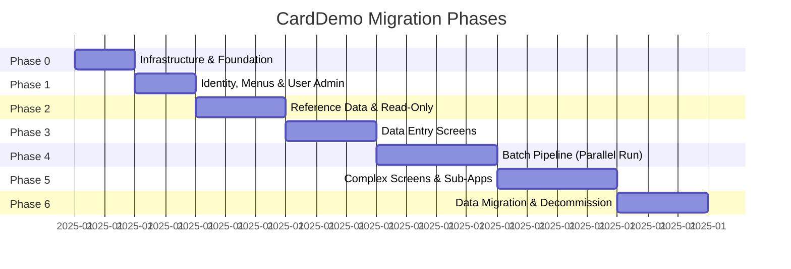

# CardDemo Cutover Plan

> **Repository:** `EvangelosG/uc-legacy-modernization-cobol-to-java`
> **Companion Documents:** [MODERNIZATION_BLUEPRINT.md](MODERNIZATION_BLUEPRINT.md) | [DOMAIN_DECOMPOSITION.md](DOMAIN_DECOMPOSITION.md) | [RISK_REGISTER.md](RISK_REGISTER.md)
> **Source Analysis:** [APPLICATION_INVENTORY.md](APPLICATION_INVENTORY.md) | [DEPENDENCY-MAP.md](DEPENDENCY-MAP.md) | [HOTSPOT-ANALYSIS.md](HOTSPOT-ANALYSIS.md) | [DATA-DICTIONARY.md](DATA-DICTIONARY.md)

---

## Table of Contents

1. [Cutover Principles](#1-cutover-principles)
2. [Phase Overview](#2-phase-overview)
3. [Phase 0 — Infrastructure & Foundation](#3-phase-0--infrastructure--foundation)
4. [Phase 1 — Identity, Menus & User Admin](#4-phase-1--identity-menus--user-admin)
5. [Phase 2 — Reference Data & Read-Only Screens](#5-phase-2--reference-data--read-only-screens)
6. [Phase 3 — Data Entry Screens](#6-phase-3--data-entry-screens)
7. [Phase 4 — Batch Pipeline (Parallel Run)](#7-phase-4--batch-pipeline-parallel-run)
8. [Phase 5 — Complex Screens & Sub-Applications](#8-phase-5--complex-screens--sub-applications)
9. [Phase 6 — Data Migration & Decommission](#9-phase-6--data-migration--decommission)
10. [Parallel-Run Validation Framework](#10-parallel-run-validation-framework)
11. [Rollback Strategy](#11-rollback-strategy)
12. [Go/No-Go Criteria Per Phase](#12-gono-go-criteria-per-phase)
13. [Timeline Estimates](#13-timeline-estimates)

---

## 1. Cutover Principles

| Principle | Rationale |
|-----------|-----------|
| **Lowest-risk first** | Build confidence and establish patterns before tackling critical financial logic. |
| **Incremental, not big-bang** | Each phase delivers independently usable functionality. Legacy and modern systems coexist via the strangler facade. |
| **Parallel-run before cutover** | Batch financial processing (Phases 4–5) runs both COBOL and Java in parallel. Outputs are compared record-by-record before the COBOL path is decommissioned. |
| **Rollback at every phase** | Each phase has a documented rollback procedure. Traffic can be routed back to CICS at the strangler layer. |
| **Data migration is the final step** | VSAM data is migrated to PostgreSQL only after all programs consuming that data have been converted. |
| **One bounded context at a time** | Each phase targets one or two bounded contexts from [DOMAIN_DECOMPOSITION.md](DOMAIN_DECOMPOSITION.md). |

---

## 2. Phase Overview



| Phase | Bounded Contexts | Strategy | Risk Level | Est. Duration |
|-------|-----------------|----------|------------|---------------|
| **0** | Cross-cutting | Foundation | Minimal | 8 weeks |
| **1** | BC-1 (Identity) | Strangler Fig | Low | 8 weeks |
| **2** | BC-9 (Reference), BC-7 (Reporting), BC-6 (Billing reads) | Strangler Fig / Rewrite | Low | 12 weeks |
| **3** | BC-3 (Card), BC-2 partial (Account View), BC-4 partial (Txn online) | Strangler Fig / Rewrite | Medium | 12 weeks |
| **4** | BC-4 (Txn batch), BC-5 (Financial Calc) | Refactor | **High** | 16 weeks |
| **5** | BC-2 (Account Update), BC-8 (Auth & Fraud), BC-12 (Extractions) | Rewrite / Replatform | **High** | 16 weeks |
| **6** | All — data migration & decommission | Migration | Medium | 12 weeks |

**Total estimated duration:** 18–21 months

---

## 3. Phase 0 — Infrastructure & Foundation

> **Risk:** Minimal | **Duration:** 8 weeks | **Dependencies:** None

### Objective

Establish the target runtime environment, build shared libraries, and deploy the strangler routing layer. No business logic is migrated in this phase.

### Deliverables

| # | Deliverable | Details |
|---|-------------|---------|
| 0.1 | **Target runtime environment** | Java 17+, Spring Boot 3.x, PostgreSQL 15+, Redis, Kafka/RabbitMQ. Deployed to cloud (AWS/Azure/GCP) or on-prem Kubernetes. |
| 0.2 | **API Gateway / Strangler Facade** | Spring Cloud Gateway configured to route traffic between CICS (legacy) and new Java services. Initial routing: 100% to CICS. |
| 0.3 | **Shared Java utility library** | Converted from COBOL utilities: `DateUtil` (replaces CSUTLDTC/CODATECN/CSDAT01Y), `MoneyUtil` (BigDecimal arithmetic matching COBOL semantics), `LookupService` (replaces CSLKPCDY area code/state code tables). |
| 0.4 | **Copybook-to-Java DTO conversion** | All 11 core copybook record layouts converted to Java classes: `AccountRecord` (CVACT01Y), `CardRecord` (CVACT02Y), `CardXrefRecord` (CVACT03Y), `CustomerRecord` (CVCUS01Y), `TransactionRecord` (CVTRA05Y), `DailyTransactionRecord` (CVTRA06Y), `CategoryBalanceRecord` (CVTRA01Y), `DisclosureGroupRecord` (CVTRA02Y), `TransactionTypeRecord` (CVTRA03Y), `TransactionCategoryRecord` (CVTRA04Y), `UserSecurityRecord` (CSUSR01Y). |
| 0.5 | **Database schema (DDL)** | PostgreSQL schema matching VSAM record layouts. Flyway migration scripts. Include DB2 table equivalents (TR_TYPE, AUTHFRDS). |
| 0.6 | **CI/CD pipeline** | Build, test, deploy automation. Parallel-run comparison framework scaffolding. |
| 0.7 | **Observability stack** | Logging (ELK/CloudWatch), metrics (Prometheus/Grafana), distributed tracing (OpenTelemetry). |

### Programs Converted

| Program | Type | LOC | Target |
|---------|------|-----|--------|
| CSUTLDTC | Utility | 157 | `DateUtil.java` — `java.time.LocalDate` |
| COBDATFT | Assembler | — | Eliminated — `java.time.format.DateTimeFormatter` |
| COBSWAIT | Utility | 41 | Eliminated — `Thread.sleep()` or scheduled executors |
| MVSWAIT | Assembler | — | Eliminated |

### Validation

- [ ] All DTO classes compile and have unit tests verifying field mappings against copybook PIC clauses
- [ ] DateUtil produces identical output to CSUTLDTC for all test cases (boundary dates, leap years, century boundaries)
- [ ] MoneyUtil arithmetic matches COBOL COMPUTE for a test suite of financial operations
- [ ] API Gateway routes traffic to CICS and returns responses correctly
- [ ] PostgreSQL schema accepts sample data from VSAM exports

### Exit Criteria

- Target environment is stable and accessible
- Shared libraries have 100% unit test coverage
- API Gateway is operational (routing 100% to legacy)
- No business logic changes — zero user-visible impact

---

## 4. Phase 1 — Identity, Menus & User Admin

> **Risk:** Low | **Duration:** 8 weeks | **Bounded Context:** BC-1 (Identity & Access)
> **Strategy:** Strangler Fig

### Objective

Replace COBOL signon, menu routing, and user administration with a modern authentication service. This is the critical enabling step — the strangler facade uses this service to route users between legacy and modern screens.

### Deliverables

| # | Deliverable | Details |
|---|-------------|---------|
| 1.1 | **Auth Service** | Spring Security + JWT. Replaces COSGN00C. Authenticates against the migrated `users` table (from USRSEC). Issues JWT tokens containing user ID, user type (admin/regular), and authorized routes. |
| 1.2 | **User Admin API** | Spring Data JPA CRUD. Replaces COUSR00C (list), COUSR01C (add), COUSR02C (update), COUSR03C (delete). REST endpoints: `GET/POST/PUT/DELETE /api/users`. |
| 1.3 | **User Admin UI** | Modern web UI (React/Angular) for user management. Replaces BMS maps COUSR00–03. |
| 1.4 | **USRSEC data migration** | Migrate user records from USRSEC.VSAM.KSDS to `users` PostgreSQL table. Hash plaintext passwords (COBOL stores passwords in PIC X(08) cleartext). |
| 1.5 | **COMMAREA Translation ACL** | Maps JWT claims to COMMAREA (COCOM01Y) user fields for legacy programs still running in CICS. |
| 1.6 | **Menu Routing Service** | Replaces COMEN01C and COADM01C menu dispatch. Routes to new Java screens (where available) or CICS programs (where not yet migrated). |

### Programs Replaced

| Program | LOC | Score | Replacement |
|---------|-----|-------|-------------|
| COSGN00C | 260 | 7 | Auth Service (Spring Security) |
| COMEN01C | 308 | 5 | Menu Routing Service |
| COADM01C | 288 | 5 | Admin Menu Routing Service |
| COUSR00C | 695 | 6 | User Admin API: `GET /api/users` |
| COUSR01C | 299 | 5 | User Admin API: `POST /api/users` |
| COUSR02C | 414 | 6 | User Admin API: `PUT /api/users/{id}` |
| COUSR03C | 359 | 6 | User Admin API: `DELETE /api/users/{id}` |

**Total LOC replaced:** 2,623

### Traffic Routing

```
Before Phase 1:  User → CICS CC00 → COSGN00C → COMEN01C/COADM01C → [all CICS]
After Phase 1:   User → API Gateway → Auth Service (JWT) → Menu Router
                                                            ├── User Admin → Java
                                                            └── All other screens → CICS (via ACL)
```

### Validation

- [ ] Users can sign in via new UI and receive JWT tokens
- [ ] Admin users can create, update, delete other users
- [ ] JWT-authenticated users can access legacy CICS screens via the COMMAREA ACL
- [ ] Migrated passwords (hashed) authenticate correctly
- [ ] PF3 back-navigation works for mixed legacy/new screens

### Rollback

- Revert API Gateway routing to 100% CICS
- USRSEC.VSAM.KSDS remains as the source of truth during this phase (dual-write to both VSAM and PostgreSQL)

---

## 5. Phase 2 — Reference Data & Read-Only Screens

> **Risk:** Low | **Duration:** 12 weeks | **Bounded Contexts:** BC-9 (Reference Data), BC-7 (Reporting), BC-6 (Billing — read paths)
> **Strategy:** Strangler Fig (read screens) + Rewrite (Tx Type Mgmt)

### Objective

Replace read-only inquiry screens and reference data management. These programs don't modify core business data, making them low-risk migration candidates.

### Deliverables

| # | Deliverable | Details |
|---|-------------|---------|
| 2.1 | **Transaction Type API** | Spring Data JPA CRUD. Replaces COTRTLIC (2,098 LOC, 28 GO TOs), COTRTUPC (1,702 LOC, 23 GO TOs), COBTUPDT (237 LOC). Eliminates VSAM shadow copies — PostgreSQL is the single source of truth. |
| 2.2 | **Reference Data UI** | Admin screens for transaction type/category management. |
| 2.3 | **Account View API** | Read-only endpoint: `GET /api/accounts/{id}`. Replaces COACTVWC (941 LOC, 9 GO TOs). |
| 2.4 | **Card Detail API** | Read-only endpoint: `GET /api/cards/{cardNumber}`. Replaces COCRDSLC (887 LOC, 9 GO TOs). |
| 2.5 | **Transaction List/View API** | Read-only endpoints: `GET /api/transactions`, `GET /api/transactions/{id}`. Replaces COTRN00C (699 LOC), COTRN01C (330 LOC). |
| 2.6 | **Auth Summary/Detail API** | Read-only endpoints. Replaces COPAUS0C (1,032 LOC), COPAUS1C (604 LOC). |
| 2.7 | **Report Request API** | Async report request: `POST /api/reports`. Replaces CORPT00C (649 LOC). Initially triggers legacy TRANREPT JCL. |
| 2.8 | **Billing View** | Read-only billing display. Replaces the read path of COBIL00C (572 LOC). |
| 2.9 | **VSAM data sync** | Replicate TRANTYPE, TRANCATG, and read-heavy VSAM data to PostgreSQL for new services. Dual-write during transition. |

### Programs Replaced

| Program | LOC | Score | Replacement |
|---------|-----|-------|-------------|
| COTRTLIC | 2,098 | 12 | Transaction Type API |
| COTRTUPC | 1,702 | 12 | Transaction Type API |
| COBTUPDT | 237 | 6 | Transaction Type API (scheduled job) |
| COACTVWC | 941 | 9 | Account View API |
| COCRDSLC | 887 | 8 | Card Detail API |
| COTRN00C | 699 | 8 | Transaction List API |
| COTRN01C | 330 | 5 | Transaction View API |
| COPAUS0C | 1,032 | 8 | Auth Summary API |
| COPAUS1C | 604 | 8 | Auth Detail API |
| CORPT00C | 649 | 8 | Report Request API |
| COBIL00C (read path) | 572 | 9 | Billing View |

**Total LOC replaced:** ~9,751

### Validation

- [ ] All read-only screens display identical data to CICS equivalents
- [ ] Transaction type CRUD produces correct DB records (compare to DB2 + VSAM)
- [ ] Report request triggers batch job and returns status
- [ ] CICS browse pagination (STARTBR/READNEXT) matches REST pagination results
- [ ] Card xref lookups return identical results to VSAM AIX reads

### Rollback

- Route affected screens back to CICS via API Gateway
- VSAM files remain the source of truth for non-reference data

---

## 6. Phase 3 — Data Entry Screens

> **Risk:** Medium | **Duration:** 12 weeks | **Bounded Contexts:** BC-3 (Card Mgmt writes), BC-4 (Transaction online writes), BC-6 (Billing writes)
> **Strategy:** Strangler Fig + Rewrite (Card Update)

### Objective

Replace screens that write data. This is the first phase where the new system modifies production data. Requires data consistency validation.

### Deliverables

| # | Deliverable | Details |
|---|-------------|---------|
| 3.1 | **Card List API** | Paginated card browse: `GET /api/cards?accountId={id}&page={n}`. Replaces COCRDLIC (1,459 LOC, 16 GO TOs). CICS STARTBR/READNEXT/ENDBR → SQL pagination. |
| 3.2 | **Card Update API** | Card modification: `PUT /api/cards/{cardNumber}`. Replaces COCRDUPC (1,560 LOC, 21 GO TOs, 8-state machine). Redesign: stateless REST with optimistic locking (version field). |
| 3.3 | **Transaction Add API** | New transaction entry: `POST /api/transactions`. Replaces COTRN02C (783 LOC). Date validation via shared DateUtil. |
| 3.4 | **Bill Payment API** | Process payments: `POST /api/billing/payments`. Replaces write path of COBIL00C. |
| 3.5 | **Card Management UI** | Modern card list/detail/update screens. |
| 3.6 | **Transaction Entry UI** | Modern transaction entry form with client-side validation. |
| 3.7 | **VSAM dual-write layer** | Writes go to both PostgreSQL and VSAM during transition. Batch programs still read VSAM until Phase 4. |

### Programs Replaced

| Program | LOC | Score | Replacement |
|---------|-----|-------|-------------|
| COCRDLIC | 1,459 | 11 | Card List API |
| COCRDUPC | 1,560 | 11 | Card Update API (rewrite — new state model) |
| COTRN02C (online) | 783 | 9 | Transaction Add API |
| COBIL00C (write path) | — | — | Bill Payment API |

**Total LOC replaced:** ~3,802

### Key Design Decisions

**COCRDUPC State Machine Redesign:**

| COBOL State (8 states) | REST Equivalent |
|------------------------|----------------|
| CCUP-DETAILS-NOT-FETCHED | `GET /api/cards/{num}` (initial load) |
| CCUP-DETAILS-FETCHED | Client-side state (form populated) |
| CCUP-CHANGES-PENDING | Client-side state (form edited) |
| CCUP-CHANGES-SUBMITTED | `PUT /api/cards/{num}` (submit) |
| CCUP-CHANGES-OKAYED | 200 OK response |
| CCUP-CHANGES-OKAYED-BUT-FAILED | 409 Conflict (optimistic lock) |
| *(lock-for-update)* | Optimistic locking via `@Version` field |
| *(pessimistic read)* | Not needed — stateless |

### Validation

- [ ] Card updates persist correctly in both PostgreSQL and VSAM
- [ ] Optimistic locking catches concurrent edits (replaces CICS pessimistic lock)
- [ ] Transaction add produces identical TRANSACT records (compare key fields)
- [ ] Billing payments update correct account balances
- [ ] Data consistency check: PostgreSQL and VSAM in sync after 1 week of dual-write

### Rollback

- Route write screens back to CICS
- PostgreSQL → VSAM resync script (run if PostgreSQL has newer data)

---

## 7. Phase 4 — Batch Pipeline (Parallel Run)

> **Risk:** **High** | **Duration:** 16 weeks | **Bounded Contexts:** BC-4 (Transaction Batch), BC-5 (Financial Calc)
> **Strategy:** Refactor (auto-convert + manual verification)

### Objective

Convert the core batch processing pipeline from COBOL/JCL to Spring Batch. This is the highest-risk phase — these programs compute account balances and interest charges for every customer. **Parallel-run validation is mandatory.**

### Deliverables

| # | Deliverable | Details |
|---|-------------|---------|
| 4.1 | **Transaction Posting Job** | Spring Batch job replacing CBTRN02C. Reads daily transactions, validates, posts to transaction table, updates account balances, writes rejects. All arithmetic uses `BigDecimal`. |
| 4.2 | **Interest Calculation Job** | Spring Batch job replacing CBACT04C. Reads accounts, looks up disclosure group rates, computes per-category interest, updates account balances. |
| 4.3 | **Transaction Report Job** | Spring Batch job replacing CBTRN03C. Multi-level break reporting (date → card → account). PIC-edited output formatting preserved exactly. |
| 4.4 | **Transaction Init Job** | Spring Batch job replacing CBTRN01C. Validates and prepares daily transaction input. |
| 4.5 | **Statement Generation Job** | Spring Batch job replacing CBSTM03A/B. Produces PDF (replacing TXT2PDF1) and HTML statements. |
| 4.6 | **Parallel-Run Orchestrator** | Automation that runs both COBOL and Java batch pipelines on the same input data and compares outputs. See [Section 10](#10-parallel-run-validation-framework). |
| 4.7 | **Batch Scheduling** | Spring Batch + Quartz/cron replacing Control-M/CA-7 job scheduling. |

### Programs Replaced

| Program | LOC | Score | Replacement |
|---------|-----|-------|-------------|
| CBTRN01C | 494 | 11 | Transaction Init Job |
| CBTRN02C | 731 | **14** | Transaction Posting Job |
| CBACT04C | 652 | **14** | Interest Calculation Job |
| CBTRN03C | 649 | 11 | Transaction Report Job |
| CBSTM03A/B | ~600 | 8 | Statement Generation Job |

**Total LOC replaced:** ~3,126

### Parallel-Run Schedule

| Week | Activity |
|------|----------|
| 1–6 | Development & unit testing |
| 7–8 | Integration testing with sample VSAM data |
| 9–12 | **Parallel run — Cycle 1** (both COBOL and Java process same daily data; compare outputs) |
| 13–14 | Fix discrepancies, adjust rounding, re-validate |
| 15–16 | **Parallel run — Cycle 2** (minimum 1 full billing cycle with zero discrepancies required for go/no-go) |

### Critical Validation Points

| Check | COBOL Source | Java Target | Tolerance |
|-------|-------------|-------------|-----------|
| Account balance after posting | CBTRN02C REWRITE ACCTFILE | `AccountRepository.save()` | **Zero** — must match to the penny |
| Interest amount per account | CBACT04C COMPUTE | `BigDecimal.multiply().setScale()` | **Zero** — must match to the penny |
| Category balance totals | CBTRN02C TCATBALF update | `CategoryBalanceRepository.save()` | **Zero** |
| Reject count & content | CBTRN02C DALYREJS | Reject file/table | **Zero** |
| Report totals (daily/card/account) | CBTRN03C multi-level breaks | Report output | **Zero** — character-by-character |
| Statement amounts | CBSTM03A | PDF/HTML output | **Zero** |
| Transaction ID sequencing | CBTRN01C | Sequence generator | **Zero** |

### Rollback

- Revert to COBOL batch pipeline. POSTTRAN/INTCALC/TRANREPT JCL remains operational throughout Phase 4.
- If parallel run shows discrepancies after Cycle 2, extend parallel run — do not cut over.

---

## 8. Phase 5 — Complex Screens & Sub-Applications

> **Risk:** **High** | **Duration:** 16 weeks | **Bounded Contexts:** BC-2 (Account Update), BC-8 (Auth & Fraud), BC-12 (Extractions)
> **Strategy:** Rewrite (COACTUPC, Extractions) + Replatform→Rewrite (Auth & Fraud)

### Objective

Tackle the most complex programs in the system. COACTUPC (4,236 LOC, score 15/15) requires manual rewrite with decomposition. The Authorization sub-app requires replatforming first, then rewriting.

### Deliverables

| # | Deliverable | Details |
|---|-------------|---------|
| 5.1 | **Account Update API** | Rewrite of COACTUPC. Decomposed into: Account Update (`PUT /api/accounts/{id}`), Customer Update (`PUT /api/customers/{id}`), shared validation utilities (SSN, phone, date). Eliminates 51 GO TOs and mixed-concern design. |
| 5.2 | **Account Update UI** | Modern form with client-side validation, replacing BMS map COACTUP. |
| 5.3 | **Auth Sub-App Replatform** | (Optional interim) Move COPAUA0C, COPAUS2C, IMS programs to Micro Focus / UniKix on Linux. This decommissions mainframe hardware. |
| 5.4 | **Authorization Service** | Rewrite: Spring Boot + Kafka (replacing MQ) + PostgreSQL (replacing IMS). REST API for authorization decisions. Event-driven processing. |
| 5.5 | **Fraud Detection Service** | Rewrite of COPAUS2C. Modern fraud rule engine with extensibility for ML models. |
| 5.6 | **Auth Batch Purge Job** | Spring Batch job replacing CBPAUP0C. Scheduled purge of expired authorizations. |
| 5.7 | **Account Extraction APIs** | REST endpoints replacing CODATE01 and COACCT01. Eliminates MQ overhead. |

### Programs Replaced

| Program | LOC | Score | Replacement |
|---------|-----|-------|-------------|
| COACTUPC | 4,236 | **15** | Account Update + Customer Update APIs |
| COPAUA0C | 1,026 | 10 | Authorization Service |
| COPAUS2C | 244 | 5 | Fraud Detection Service |
| CBPAUP0C | 386 | 8 | Auth Purge Job |
| CODATE01 | 524 | 4 | REST endpoint (eliminated) |
| COACCT01 | 620 | 4 | REST endpoint (eliminated) |
| PAUDBLOD | — | — | Eliminated (JPA handles persistence) |
| PAUDBUNL | — | — | Eliminated |
| DBUNLDGS | — | — | Eliminated |

**Total LOC replaced:** ~7,036+

### COACTUPC Decomposition Detail

```
COACTUPC (4,236 LOC, 51 GO TOs, 168 IFs, 56 copybooks)
   │
   ├─ AccountUpdateService.java (~200 LOC)
   │    PUT /api/accounts/{id}
   │    - Validates account fields (credit limit, status, dates)
   │    - Optimistic locking via @Version
   │    - Audit logging
   │
   ├─ CustomerUpdateService.java (~200 LOC)
   │    PUT /api/customers/{id}
   │    - Validates customer PII (name, address, phone, SSN)
   │    - SSN format validation (extracted from inline COACTUPC logic)
   │    - Phone number parsing (extracted from inline logic)
   │
   ├─ ValidationService.java (~100 LOC)
   │    - SSN validation (replaces inline COACTUPC SSN parsing)
   │    - Phone area code lookup (replaces CSLKPCDY 1,318-line table)
   │    - Date validation (uses shared DateUtil from Phase 0)
   │
   └─ AccountUpdateController.java (~50 LOC)
        - Request routing and error handling
        - Maps to COACTUPC screen workflows
```

### Validation

- [ ] Account Update API produces identical data changes for a test suite of 100+ account modifications
- [ ] Customer PII updates (SSN, phone, address) validate correctly with edge cases
- [ ] Authorization decisions from new service match COPAUA0C for historical test data
- [ ] Auth purge job produces same results as CBPAUP0C
- [ ] MQ → Kafka message flow operates correctly for auth requests

### Rollback

- COACTUPC: Route back to CICS via API Gateway
- Auth sub-app: Revert to replatformed COBOL (or original mainframe if replatform was skipped)
- IMS data remains accessible via the replatformed environment

---

## 9. Phase 6 — Data Migration & Decommission

> **Risk:** Medium | **Duration:** 12 weeks | **Bounded Contexts:** All — final migration + cleanup
> **Strategy:** Rewrite (migration utilities) + Decommission

### Objective

Complete the data migration from VSAM to PostgreSQL, replace remaining utility programs, decommission the mainframe environment, and tear down the strangler facade.

### Deliverables

| # | Deliverable | Details |
|---|-------------|---------|
| 6.1 | **VSAM → PostgreSQL full migration** | Final one-time data migration for all remaining VSAM datasets. Validate row counts, checksums, and key field values. |
| 6.2 | **Migration validation suite** | Automated comparison of VSAM and PostgreSQL data. Every record in every dataset verified. |
| 6.3 | **Data migration utilities (new)** | Java-based ETL tools replacing CBEXPORT/CBIMPORT. Purpose-built for VSAM → PostgreSQL. |
| 6.4 | **File init programs (eliminated)** | CBACT01C, CBACT02C, CBACT03C, CBCUS01C replaced by Flyway migrations + JPA seed data. |
| 6.5 | **JCL infrastructure (eliminated)** | OPENFIL, CLOSEFIL, DEFGDGB, DEFGDGD, TRANBKP, COMBTRAN — all functions handled by the application server and database. |
| 6.6 | **Strangler facade teardown** | Remove the API Gateway routing layer. All traffic goes directly to Java services. |
| 6.7 | **CICS decommission** | Shut down CICS region. Archive CSD definitions. |
| 6.8 | **Mainframe decommission** | (If applicable) Decommission mainframe or replatform environment. |

### Programs Replaced (Remaining)

| Program | LOC | Score | Replacement |
|---------|-----|-------|-------------|
| CBEXPORT | 582 | 8 | New Java ETL tool |
| CBIMPORT | 487 | 8 | New Java ETL tool |
| CBACT01C | 430 | 8 | Flyway migration |
| CBACT02C | 178 | 3 | Flyway migration |
| CBACT03C | 178 | 3 | Flyway migration |
| CBCUS01C | 178 | 3 | Flyway migration |
| COBSWAIT | 41 | 3 | Eliminated |

### Migration Validation Checklist

| Dataset | Records (est.) | Validation Method |
|---------|---------------|-------------------|
| ACCTDATA | ~10,000 | Row count + every field checksum |
| CARDDATA | ~10,000 | Row count + primary key match |
| CARDXREF | ~10,000 | Row count + FK integrity check |
| CUSTDATA | ~10,000 | Row count + PII field verification |
| TRANSACT | ~100,000+ | Row count + balance checksums |
| USRSEC | ~100 | Full record comparison |
| TCATBALF | ~5,000 | Row count + category totals match |
| DISCGRP | ~50 | Full record comparison |
| TRANTYPE | ~50 | Full record comparison |
| TRANCATG | ~50 | Full record comparison |

### Rollback

- In the unlikely event of critical issues, VSAM datasets and CICS region can be restored from backups. Mainframe decommission should only proceed after 30 days of stable Java-only operation.

---

## 10. Parallel-Run Validation Framework

The parallel-run framework is critical for Phase 4 (batch) and useful for Phases 2–3 (online screens).

### Architecture

```
                    ┌────────────────────────┐
                    │    Daily Input Data     │
                    │    (DALYTRAN.PS)        │
                    └─────────┬──────────────┘
                              │
              ┌───────────────┼───────────────┐
              │                               │
              ▼                               ▼
    ┌─────────────────┐            ┌─────────────────┐
    │  COBOL Pipeline  │            │  Java Pipeline   │
    │  (POSTTRAN JCL)  │            │  (Spring Batch)  │
    │                  │            │                  │
    │  CBTRN01C        │            │  TxnInitJob      │
    │  CBTRN02C        │            │  TxnPostJob      │
    │  CBACT04C        │            │  InterestCalcJob  │
    │  CBTRN03C        │            │  TxnReportJob    │
    └────────┬────────┘            └────────┬────────┘
             │                              │
             ▼                              ▼
    ┌─────────────────┐            ┌─────────────────┐
    │  COBOL Output    │            │  Java Output     │
    │  (VSAM files,    │            │  (PostgreSQL,    │
    │   reports,       │            │   reports,       │
    │   rejects)       │            │   rejects)       │
    └────────┬────────┘            └────────┬────────┘
             │                              │
             └──────────┬───────────────────┘
                        │
                        ▼
              ┌─────────────────┐
              │  Comparison     │
              │  Engine         │
              │                 │
              │  Record-by-     │
              │  record diff    │
              │                 │
              │  Tolerance:     │
              │  ZERO           │
              └────────┬────────┘
                       │
                       ▼
              ┌─────────────────┐
              │  Discrepancy    │
              │  Report         │
              │                 │
              │  Per-account    │
              │  balance diff   │
              │  Per-field      │
              │  comparison     │
              └─────────────────┘
```

### Comparison Points

| Comparison | COBOL Output | Java Output | Method |
|------------|-------------|-------------|--------|
| Account balances | ACCTDATA after CBTRN02C | `accounts` table after TxnPostJob | SELECT all, compare ACCT-CURR-BAL |
| Category balances | TCATBALF after CBTRN02C | `category_balances` table | Compare per-account per-category |
| Transaction records | TRANSACT after CBTRN02C | `transactions` table | Compare per-transaction fields |
| Reject records | DALYREJS file | Rejects table/file | Count + content comparison |
| Interest amounts | ACCTDATA after CBACT04C | `accounts` table after InterestCalcJob | Compare interest-affected fields |
| Report output | TRANREPT file | Report output file | Character-by-character diff |

### Go/No-Go Rule

**Zero tolerance.** If any account balance, transaction amount, or interest calculation differs by even $0.01, the discrepancy must be investigated and resolved before cutover. The parallel run continues until 2 consecutive billing cycles produce zero discrepancies.

---

## 11. Rollback Strategy

Every phase supports rollback to the previous stable state.

| Phase | Rollback Mechanism | Recovery Time |
|-------|-------------------|---------------|
| 0 | N/A (no business logic) | N/A |
| 1 | API Gateway routes 100% to CICS | < 5 minutes |
| 2 | Route read screens back to CICS | < 5 minutes |
| 3 | Route write screens back to CICS; resync PostgreSQL → VSAM | < 30 minutes |
| 4 | Revert to COBOL batch (JCL). PostgreSQL data discarded; VSAM is source of truth | < 1 hour |
| 5 | Route COACTUPC/Auth back to CICS/replatform | < 30 minutes |
| 6 | Restore VSAM from backup; restart CICS | < 4 hours |

### Rollback Principles

1. **VSAM remains the source of truth** until the end of Phase 5. Only Phase 6 makes PostgreSQL the sole source.
2. **Dual-write is active** during Phases 3–5 for datasets being migrated. Writes go to both VSAM and PostgreSQL.
3. **API Gateway is the rollback switch** — traffic routing changes are immediate and require no code deployment.
4. **Phase 6 rollback is a last resort** and requires VSAM backup restoration.

---

## 12. Go/No-Go Criteria Per Phase

| Phase | Go Criteria | No-Go Triggers |
|-------|------------|----------------|
| **0** | All shared utilities pass unit tests; API Gateway routes to CICS; PostgreSQL schema deployed | Build failures; utility arithmetic discrepancies |
| **1** | Auth + User CRUD functional; JWT→COMMAREA ACL works; legacy screens accessible via new auth | Auth failures; users locked out; CICS access broken |
| **2** | All read screens display correct data; Tx Type CRUD matches DB2 output | Data discrepancies in any read screen; pagination errors |
| **3** | Writes persist correctly in PostgreSQL + VSAM; optimistic locking works; 1-week dual-write consistency check passes | Any data loss; dual-write inconsistencies; concurrency bugs |
| **4** | **2 consecutive billing cycles with zero discrepancies** in parallel run | Any financial discrepancy (even $0.01); reject count mismatch; report total difference |
| **5** | COACTUPC replacement produces identical data changes; Auth service processes requests correctly; 2-week soak test passes | Data corruption; auth decision discrepancies; performance degradation |
| **6** | 100% data migrated and validated; 30-day stable operation on Java-only | Migration data loss; validation failures; performance issues |

---

## 13. Timeline Estimates

### Conservative Estimate (Small Team: 4–6 Engineers)

| Phase | Start | End | Duration | Team Focus |
|-------|-------|-----|----------|-----------|
| 0 | Month 1 | Month 2 | 8 weeks | Full team: infrastructure, DTOs, utilities |
| 1 | Month 3 | Month 4 | 8 weeks | 2 engineers: auth + user admin |
| 2 | Month 5 | Month 7 | 12 weeks | 3 engineers: read screens + Tx Type rewrite |
| 3 | Month 8 | Month 10 | 12 weeks | 3 engineers: write screens + Card Update rewrite |
| 4 | Month 11 | Month 14 | 16 weeks | 4 engineers: batch + parallel run (2 cycles) |
| 5 | Month 15 | Month 18 | 16 weeks | 4 engineers: COACTUPC rewrite + Auth sub-app |
| 6 | Month 19 | Month 21 | 12 weeks | 2 engineers: migration + decommission |

**Total: ~21 months**

### Aggressive Estimate (Large Team: 8–12 Engineers + COBOL SME)

| Phase | Duration | Notes |
|-------|----------|-------|
| 0 | 4 weeks | Parallelized infrastructure setup |
| 1 | 4 weeks | Overlap with Phase 0 tail |
| 2 | 8 weeks | Multiple read screens in parallel |
| 3 | 8 weeks | Write screens in parallel |
| 4 | 12 weeks | Parallel run cannot be shortened (2 billing cycles minimum) |
| 5 | 12 weeks | COACTUPC + Auth in parallel tracks |
| 6 | 8 weeks | Accelerated migration |

**Total: ~14 months** (limited by parallel-run validation duration)

### Critical Path

The critical path is **Phase 4** — the batch pipeline parallel run. This phase cannot be shortened below 12 weeks because it requires at least 2 full billing cycles of zero-discrepancy parallel operation. All other phases can be compressed with additional staffing.

---

*Cross-references: [MODERNIZATION_BLUEPRINT.md](MODERNIZATION_BLUEPRINT.md) | [DOMAIN_DECOMPOSITION.md](DOMAIN_DECOMPOSITION.md) | [RISK_REGISTER.md](RISK_REGISTER.md)*
