# CardDemo Dependency Map

Call graph and data lineage for every program, JCL job, and dataset in the
CardDemo application.  Cross-references `APPLICATION_INVENTORY.md`, `DATA-DICTIONARY.md`,
and `HOTSPOT-ANALYSIS.md`.

---

## Table of Contents

1. [Online (CICS) Navigation Graph](#1-online-cics-navigation-graph)
2. [Program-to-Program Call Graph](#2-program-to-program-call-graph)
3. [Batch Processing Chains](#3-batch-processing-chains)
4. [JCL Job → Program → Dataset Matrix](#4-jcl-job--program--dataset-matrix)
5. [VSAM Dataset Lineage](#5-vsam-dataset-lineage)
6. [CICS Logical File Map](#6-cics-logical-file-map)
7. [Copybook Dependency Matrix](#7-copybook-dependency-matrix)
8. [External System Interfaces](#8-external-system-interfaces)
9. [Impact Analysis Quick-Reference](#9-impact-analysis-quick-reference)

---

## 1. Online (CICS) Navigation Graph

The online application uses pseudo-conversational CICS with XCTL (transfer
control) to navigate between screens.  The COMMAREA copybook `COCOM01Y`
carries `CDEMO-FROM-PROGRAM` and `CDEMO-TO-PROGRAM` fields for dynamic
routing.

### Entry Point

```
CICS Transaction "CC00" → COSGN00C (Sign-On)
```

### Sign-On Routing

```
COSGN00C
  ├─ Admin user  → XCTL PROGRAM('COADM01C')   (Admin Menu)
  └─ Regular user → XCTL PROGRAM('COMEN01C')   (Main Menu)
```

### Main Menu (COMEN01C) — 11 Options

The menu option table is defined in copybook `COMEN02Y`:

| # | Menu Label | Target Program | Function |
|---|-----------|---------------|----------|
| 1 | Account View | COACTVWC | View account details |
| 2 | Account Update | COACTUPC | Update account/customer |
| 3 | Credit Card List | COCRDLIC | Browse cards by account |
| 4 | Credit Card View | COCRDSLC | View card details |
| 5 | Credit Card Update | COCRDUPC | Update card details |
| 6 | Transaction List | COTRN00C | Browse transactions |
| 7 | Transaction View | COTRN01C | View transaction details |
| 8 | Transaction Add | COTRN02C | Add new transaction |
| 9 | Transaction Reports | CORPT00C | Generate transaction reports |
| 10 | Bill Payment | COBIL00C | Process bill payments |
| 11 | Pending Authorization View | COPAUS0C | View pending authorizations |

All options use `XCTL PROGRAM(CDEMO-MENU-OPT-PGMNAME(WS-OPTION))`.
PF3 from any screen returns to the calling program via
`XCTL PROGRAM(CDEMO-TO-PROGRAM)`.

### Admin Menu (COADM01C) — 6 Options

The admin option table is defined in copybook `COADM02Y`:

| # | Menu Label | Target Program | Function |
|---|-----------|---------------|----------|
| 1 | User List (Security) | COUSR00C | Browse user list |
| 2 | User Add (Security) | COUSR01C | Add new user |
| 3 | User Update (Security) | COUSR02C | Update user record |
| 4 | User Delete (Security) | COUSR03C | Delete user record |
| 5 | Transaction Type List/Update (Db2) | COTRTLIC | Browse transaction types |
| 6 | Transaction Type Maintenance (Db2) | COTRTUPC | Maintain transaction types |

### Sub-Screen Navigation

Programs that navigate to each other within functional domains:

```
Account/Card Domain:
  COCRDLIC (Card List)
    ├─ Select for View  → XCTL PROGRAM('COCRDSLC')  (Card Detail)
    └─ Select for Update → XCTL PROGRAM('COCRDUPC')  (Card Update)

  COACTVWC (Account View)
    └─ references COCRDLIC, COCRDUPC, COCRDSLC via LIT- constants

  COACTUPC (Account Update)
    └─ references COCRDLIC, COCRDUPC, COCRDSLC, COMEN01C via LIT- constants

  COCRDSLC (Card Detail)
    └─ Back → COCRDLIC (card list) or COMEN01C (menu)

  COCRDUPC (Card Update)
    └─ Back → COCRDLIC (card list), COCRDSLC (detail), or COMEN01C (menu)

Transaction Type Domain (DB2 sub-app):
  COTRTLIC (Transaction Type List)
    ├─ Select for Add/Update → XCTL PROGRAM('COTRTUPC')
    └─ Back → XCTL PROGRAM('COADM01C')

  COTRTUPC (Transaction Type Update)
    └─ Back → XCTL PROGRAM(CDEMO-TO-PROGRAM)  [typically COTRTLIC]

Authorization Domain (IMS-DB2-MQ sub-app):
  COPAUS0C (Auth Summary)
    └─ Select → XCTL PROGRAM(CDEMO-TO-PROGRAM)

  COPAUS1C (Auth Detail)
    ├─ LINK PROGRAM(WS-PGM-AUTH-FRAUD='COPAUS2C')  (fraud check)
    └─ Back → XCTL PROGRAM(CDEMO-TO-PROGRAM)  [COPAUS0C]
```

### Complete Online Navigation Diagram

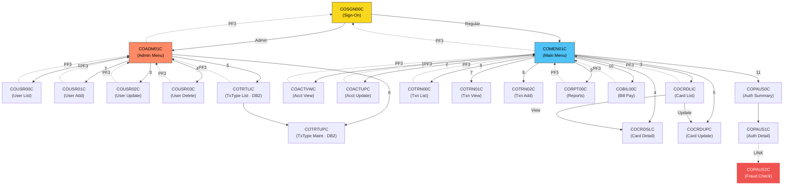

---

## 2. Program-to-Program Call Graph

### XCTL (Transfer Control) — Online Programs

| Source Program | Target Program | Mechanism | Context |
|---------------|---------------|-----------|---------|
| COSGN00C | COADM01C | `XCTL PROGRAM('COADM01C')` | Admin sign-on |
| COSGN00C | COMEN01C | `XCTL PROGRAM('COMEN01C')` | Regular sign-on |
| COMEN01C | *dynamic* | `XCTL PROGRAM(CDEMO-MENU-OPT-PGMNAME)` | Menu option dispatch |
| COMEN01C | COSGN00C | `MOVE 'COSGN00C' TO CDEMO-TO-PROGRAM` | PF3 sign-off |
| COADM01C | *dynamic* | `XCTL PROGRAM(CDEMO-ADMIN-OPT-PGMNAME)` | Admin option dispatch |
| COADM01C | COSGN00C | `MOVE 'COSGN00C' TO CDEMO-TO-PROGRAM` | PF3 sign-off |
| COCRDLIC | COMEN01C | `XCTL PROGRAM(LIT-MENUPGM)` | PF3 back to menu |
| COCRDLIC | COCRDSLC | `XCTL PROGRAM(CCARD-NEXT-PROG)` via `LIT-CARDDTLPGM` | View card detail |
| COCRDLIC | COCRDUPC | `XCTL PROGRAM(CCARD-NEXT-PROG)` via `LIT-CARDUPDPGM` | Update card |
| COACTVWC | *dynamic* | `XCTL PROGRAM(CDEMO-TO-PROGRAM)` | PF3 back |
| COACTUPC | *dynamic* | `XCTL PROGRAM(CDEMO-TO-PROGRAM)` | PF3 back |
| COCRDSLC | *dynamic* | `XCTL PROGRAM(CDEMO-TO-PROGRAM)` | PF3 back |
| COCRDUPC | *dynamic* | `XCTL PROGRAM(CDEMO-TO-PROGRAM)` | PF3 back |
| COTRTLIC | COTRTUPC | `XCTL PROGRAM(LIT-ADDTPGM='COTRTUPC')` | Add/update tx type |
| COTRTLIC | *dynamic* | `XCTL PROGRAM(CDEMO-TO-PROGRAM)` | PF3 back |
| COTRTUPC | *dynamic* | `XCTL PROGRAM(CDEMO-TO-PROGRAM)` | PF3 back |
| COTRN00C | *dynamic* | `XCTL PROGRAM(CDEMO-TO-PROGRAM)` | PF3 back |
| COTRN01C | *dynamic* | `XCTL PROGRAM(CDEMO-TO-PROGRAM)` | PF3 back |
| COTRN02C | *dynamic* | `XCTL PROGRAM(CDEMO-TO-PROGRAM)` | PF3 back |
| CORPT00C | *dynamic* | `XCTL PROGRAM(CDEMO-TO-PROGRAM)` | PF3 back |
| COBIL00C | *dynamic* | `XCTL PROGRAM(CDEMO-TO-PROGRAM)` | PF3 back |
| COPAUS0C | *dynamic* | `XCTL PROGRAM(CDEMO-TO-PROGRAM)` | PF3 back |
| COPAUS1C | *dynamic* | `XCTL PROGRAM(CDEMO-TO-PROGRAM)` | PF3 back |
| COUSR00C | *dynamic* | `XCTL PROGRAM(CDEMO-TO-PROGRAM)` | PF3 back |
| COUSR01C | *dynamic* | `XCTL PROGRAM(CDEMO-TO-PROGRAM)` | PF3 back |
| COUSR02C | *dynamic* | `XCTL PROGRAM(CDEMO-TO-PROGRAM)` | PF3 back |
| COUSR03C | *dynamic* | `XCTL PROGRAM(CDEMO-TO-PROGRAM)` | PF3 back |

### LINK (Subroutine Call) — Online Programs

| Source | Target | Mechanism |
|--------|--------|-----------|
| COPAUS1C | COPAUS2C | `EXEC CICS LINK PROGRAM(WS-PGM-AUTH-FRAUD='COPAUS2C')` |

### CALL — Batch & Utility Programs

| Source Program | Target | API | Purpose |
|---------------|--------|-----|---------|
| CORPT00C | CSUTLDTC | `CALL 'CSUTLDTC'` | Date validation utility |
| COTRN02C | CSUTLDTC | `CALL 'CSUTLDTC'` | Date validation utility |
| CSUTLDTC | CEEDAYS | `CALL 'CEEDAYS'` | LE date conversion |
| CBACT01C | COBDATFT | `CALL 'COBDATFT'` | Date formatting (via CODATECN) |
| COBSWAIT | MVSWAIT | `CALL 'MVSWAIT'` | MVS wait (timing) |
| COPAUA0C | MQOPEN | `CALL 'MQOPEN'` | MQ queue open |
| COPAUA0C | MQGET | `CALL 'MQGET'` | MQ message get |
| COPAUA0C | MQPUT1 | `CALL 'MQPUT1'` | MQ message put |
| COPAUA0C | MQCLOSE | `CALL 'MQCLOSE'` | MQ queue close |
| PAUDBLOD | CBLTDLI | `CALL 'CBLTDLI'` | IMS DLI — ISRT, GU |
| PAUDBUNL | CBLTDLI | `CALL 'CBLTDLI'` | IMS DLI — GN, GNP |
| DBUNLDGS | CBLTDLI | `CALL 'CBLTDLI'` | IMS DLI — GN, GNP, ISRT |

### CALL — Abend Handler (CEE3ABD)

All batch programs call `CEE3ABD` for abnormal termination:

CBTRN01C, CBTRN02C, CBTRN03C, CBACT01C, CBACT02C, CBACT03C, CBACT04C,
CBCUS01C, CBEXPORT, CBIMPORT

---

## 3. Batch Processing Chains

### Daily Transaction Posting (POSTTRAN)

The core batch cycle that posts daily transactions:

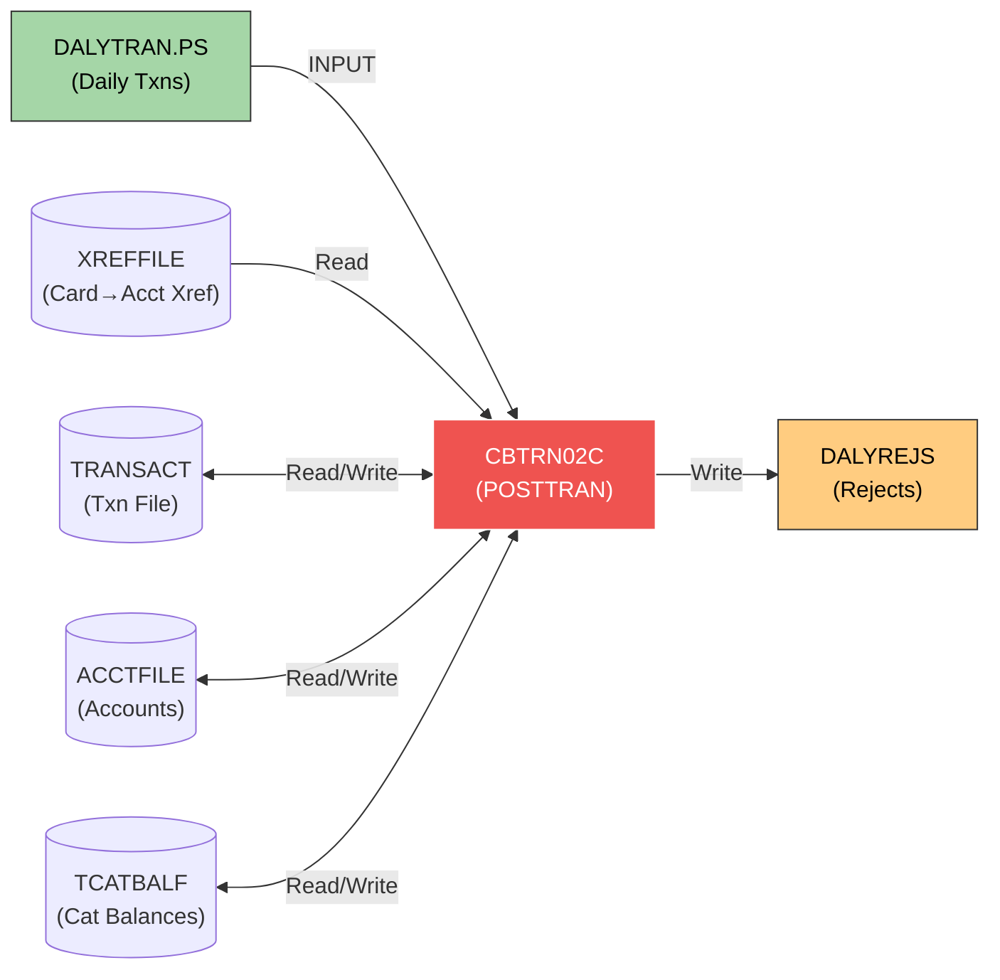

**Input**: `DALYTRAN.PS` — daily transaction flat file
**Reads**: `XREFFILE` (card-to-account xref), `ACCTFILE` (account balances), `TRANSACT` (existing transactions), `TCATBALF` (category balances)
**Writes**: `TRANSACT` (new transactions), `ACCTFILE` (updated balances), `TCATBALF` (updated category balances), `DALYREJS` (rejects)

### Transaction Initialization (CBTRN01C)

Validates and prepares daily transactions before posting:

```
CBTRN01C
  Reads:  DALYTRAN.PS, CUSTFILE, XREFFILE, CARDFILE, ACCTFILE
  Writes: TRANFILE (validated transactions)
```

### Interest Calculation (INTCALC)

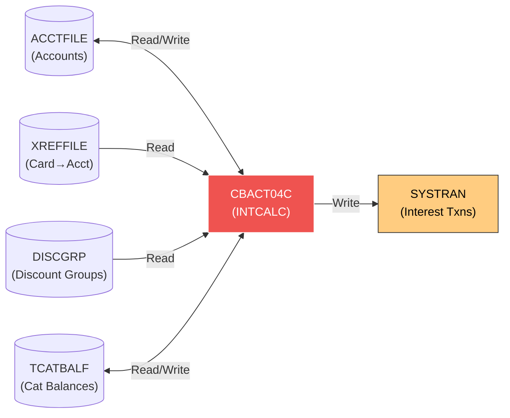

### Daily Transaction Report (TRANREPT)

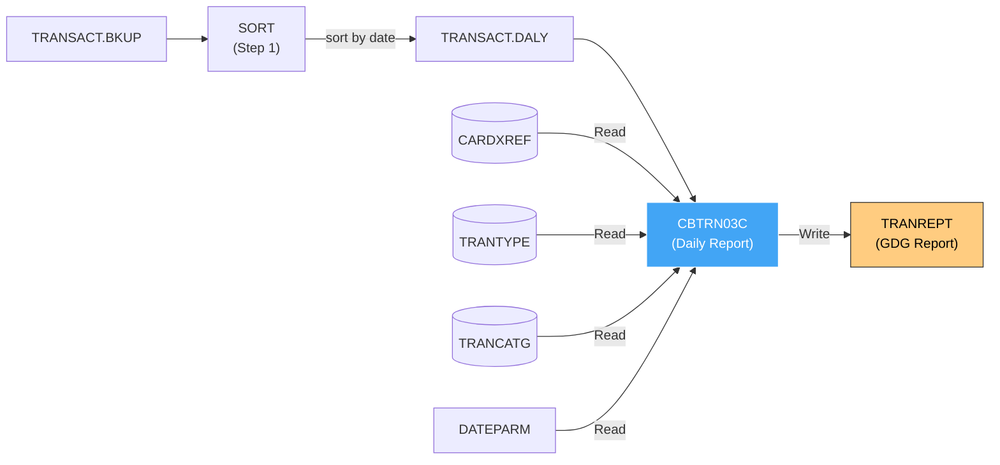

### Statement Generation (CREASTMT)

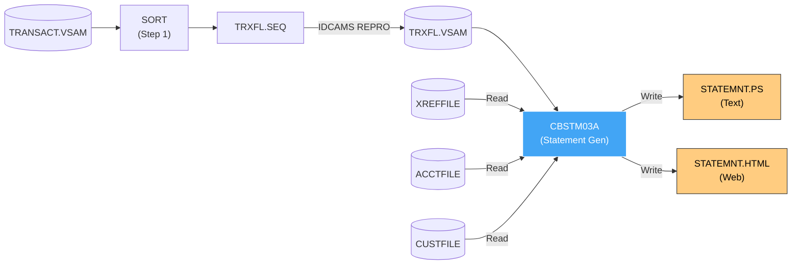

### Data Export / Import

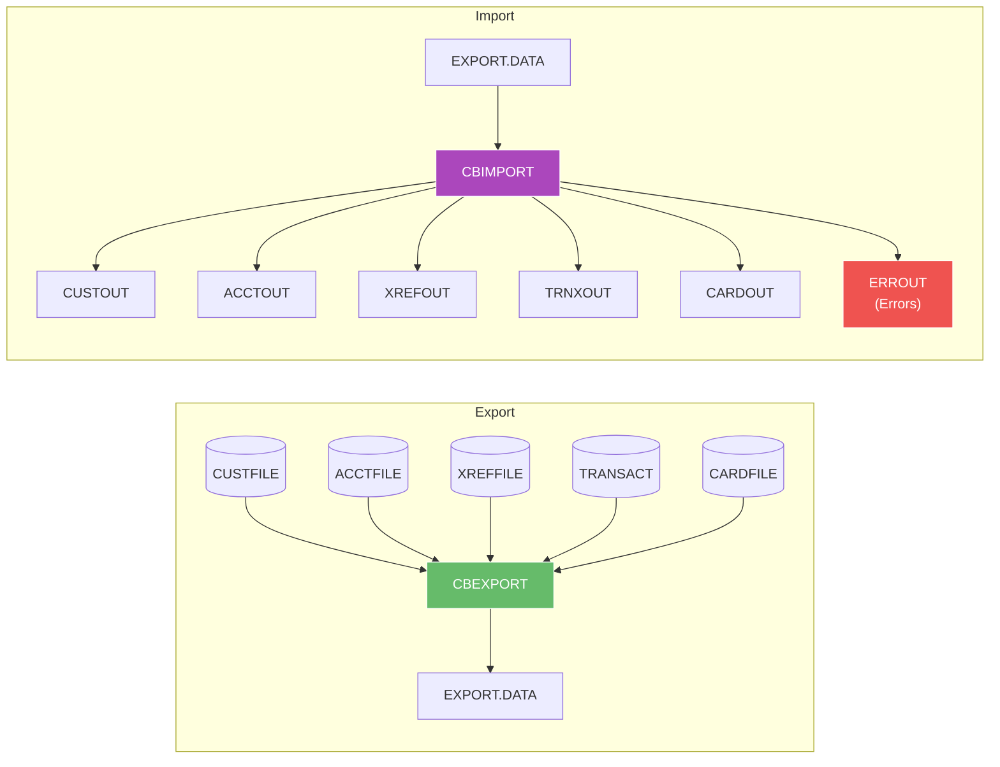

### Account/Card/Xref/Customer Read Jobs

Simple dump programs for verification:

| JCL Job | Program | Reads | Writes |
|---------|---------|-------|--------|
| READACCT | CBACT01C | ACCTFILE.VSAM.KSDS | OUTFILE (PS), ARRYFILE, VBRCFILE |
| READCARD | CBACT02C | CARDDATA.VSAM.KSDS | SYSOUT (display) |
| READXREF | CBACT03C | CARDXREF.VSAM.KSDS | SYSOUT (display) |
| READCUST | CBCUS01C | CUSTDATA.VSAM.KSDS | SYSOUT (display) |

### Transaction Backup (TRANBKP)

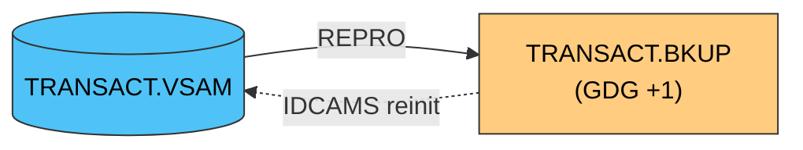

### Combined Transaction Sort (COMBTRAN)

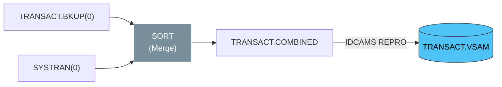

---

## 4. JCL Job → Program → Dataset Matrix

### Jobs That Execute COBOL Programs

| JCL Job | COBOL Program | Datasets Referenced |
|---------|--------------|-------------------|
| POSTTRAN | CBTRN02C | DALYTRAN.PS, TRANSACT.VSAM.KSDS, XREFFILE.VSAM.KSDS, DALYREJS, ACCTDATA.VSAM.KSDS, TCATBALF.VSAM.KSDS |
| INTCALC | CBACT04C | ACCTDATA.VSAM.KSDS, CARDXREF.VSAM.AIX.PATH, CARDXREF.VSAM.KSDS, DISCGRP.VSAM.KSDS, SYSTRAN, TCATBALF.VSAM.KSDS |
| TRANREPT | CBTRN03C | TRANSACT.DALY(+1), CARDXREF.VSAM.KSDS, TRANTYPE.VSAM.KSDS, TRANCATG.VSAM.KSDS, DATEPARM, TRANREPT(+1) |
| READACCT | CBACT01C | ACCTDATA.VSAM.KSDS, ACCTDATA.PSCOMP, ACCTDATA.ARRYPS, ACCTDATA.VBPS |
| READCARD | CBACT02C | CARDDATA.VSAM.KSDS |
| READCUST | CBCUS01C | CUSTDATA.VSAM.KSDS |
| READXREF | CBACT03C | CARDXREF.VSAM.KSDS |
| CBEXPORT | CBEXPORT | ACCTDATA.VSAM.KSDS, CARDDATA.VSAM.KSDS, CARDXREF.VSAM.KSDS, CUSTDATA.VSAM.KSDS, TRANSACT.VSAM.KSDS, EXPORT.DATA |
| CBIMPORT | CBIMPORT | EXPORT.DATA, ACCTDATA.IMPORT, CARDXREF.IMPORT, CUSTDATA.IMPORT, TRANSACT.IMPORT, IMPORT.ERRORS |
| CREASTMT | CBSTM03A | TRXFL.VSAM.KSDS, CARDXREF.VSAM.KSDS, ACCTDATA.VSAM.KSDS, CUSTDATA.VSAM.KSDS, STATEMNT.PS, STATEMNT.HTML |
| WAITSTEP | COBSWAIT | *(none — timing utility)* |

### VSAM File Definition/Load Jobs (IDCAMS)

| JCL Job | Function | Dataset Defined/Loaded |
|---------|----------|----------------------|
| ACCTFILE | Define & load account VSAM | ACCTDATA.VSAM.KSDS ← ACCTDATA.PS |
| CARDFILE | Define & load card VSAM | CARDDATA.VSAM.KSDS ← CARDDATA.PS |
| CUSTFILE | Define & load customer VSAM | CUSTDATA.VSAM.KSDS ← CUSTDATA.PS |
| XREFFILE | Define & load xref VSAM + AIX | CARDXREF.VSAM.KSDS ← CARDXREF.PS |
| TRANFILE | Define & load transaction VSAM | TRANSACT.VSAM.KSDS ← DALYTRAN.PS.INIT |
| TRANTYPE | Define & load tx type VSAM | TRANTYPE.VSAM.KSDS ← TRANTYPE.PS |
| TRANCATG | Define & load tx category VSAM | TRANCATG.VSAM.KSDS ← TRANCATG.PS |
| TCATBALF | Define & load category balance VSAM | TCATBALF.VSAM.KSDS ← TCATBALF.PS |
| DISCGRP | Define & load discount group VSAM | DISCGRP.VSAM.KSDS ← DISCGRP.PS |
| DUSRSECJ | Define & load user security VSAM | USRSEC.VSAM.KSDS ← USRSEC.PS |

### Utility Jobs

| JCL Job | Function |
|---------|----------|
| OPENFIL | SDSF — open CICS files |
| CLOSEFIL | SDSF — close CICS files |
| TRANBKP | Backup TRANSACT.VSAM.KSDS → TRANSACT.BKUP (GDG) |
| COMBTRAN | Merge TRANSACT.BKUP + SYSTRAN → reload TRANSACT.VSAM.KSDS |
| PRTCATBL | Sort & print TCATBALF.VSAM.KSDS → TCATBALF.REPT |
| DEFGDGB | Define GDG base for TRANSACT.BKUP |
| DEFGDGD | Define GDG bases for TRANTYPE.BKUP, TRANCATG.PS.BKUP, DISCGRP.BKUP |
| DALYREJS | Define daily rejects dataset |
| REPTFILE | Define report dataset |
| TRANIDX | Define transaction AIX/PATH |
| ESDSRRDS | Define ESDS/RRDS alternate VSAM structures for USRSEC |
| CBADMCDJ | DFHCSDUP — define CICS CSD resources |
| TXT2PDF1 | Convert STATEMNT.PS → PDF |
| FTPJCL | FTP file transfer |
| INTRDRJ1/J2 | Internal reader — chained JCL submission |

---

## 5. VSAM Dataset Lineage

Which programs read from and write to each dataset.  "Online" = CICS
`EXEC CICS READ/WRITE/REWRITE/DELETE/STARTBR/READNEXT`.
"Batch" = standard COBOL file I/O (`OPEN/READ/WRITE/REWRITE/CLOSE`).

### VSAM Read/Write Overview

```mermaid
flowchart TD
    subgraph Online["Online (CICS) Programs"]
        COACTVWC["COACTVWC\n(Acct View)"]
        COACTUPC["COACTUPC\n(Acct Update)"]
        COCRDLIC["COCRDLIC\n(Card List)"]
        COCRDSLC["COCRDSLC\n(Card Detail)"]
        COCRDUPC["COCRDUPC\n(Card Update)"]
        COSGN00C["COSGN00C\n(Sign-On)"]
        COUSR00C["COUSR00C\n(User List)"]
        COUSR01C["COUSR01C\n(User Add)"]
        COUSR02C["COUSR02C\n(User Update)"]
        COUSR03C["COUSR03C\n(User Delete)"]
    end

    subgraph Batch["Batch Programs"]
        CBTRN02C["CBTRN02C\n(Post Txns)"]
        CBACT04C["CBACT04C\n(Interest)"]
        CBTRN01C["CBTRN01C\n(Validate)"]
        CBTRN03C["CBTRN03C\n(Report)"]
        CBEXPORT["CBEXPORT"]
        CBSTM03A["CBSTM03A\n(Statements)"]
    end

    subgraph VSAM["Core VSAM Datasets"]
        ACCTDATA[("ACCTDATA\n(Accounts)")]
        CARDDATA[("CARDDATA\n(Cards)")]
        CARDXREF[("CARDXREF\n(Xref)")]
        CUSTDATA[("CUSTDATA\n(Customers)")]
        TRANSACT[("TRANSACT\n(Transactions)")]
        USRSEC[("USRSEC\n(Security)")]
    end

    %% Online reads
    ACCTDATA -->|R| COACTVWC
    ACCTDATA <-->|R/W| COACTUPC
    CARDDATA -->|R| COACTVWC
    CARDDATA -->|R| COCRDSLC
    CARDDATA <-->|R/W| COCRDUPC
    CARDDATA -->|Browse| COCRDLIC
    CUSTDATA -->|R| COACTVWC
    CUSTDATA <-->|R/W| COACTUPC
    CUSTDATA -->|R| COCRDSLC
    CUSTDATA -->|R| COCRDUPC
    USRSEC -->|R| COSGN00C
    USRSEC -->|Browse| COUSR00C
    USRSEC <-->|W| COUSR01C
    USRSEC <-->|R/W| COUSR02C
    USRSEC <-->|Del| COUSR03C

    %% Batch reads/writes
    ACCTDATA <-->|R/W| CBTRN02C
    ACCTDATA <-->|R/W| CBACT04C
    ACCTDATA -->|R| CBEXPORT
    ACCTDATA -->|R| CBSTM03A
    CARDXREF -->|R| CBTRN01C
    CARDXREF -->|R| CBTRN02C
    CARDXREF -->|R| CBTRN03C
    CARDXREF -->|R| CBACT04C
    CARDXREF -->|R| CBEXPORT
    CARDXREF -->|R| CBSTM03A
    TRANSACT <-->|R/W| CBTRN02C
    TRANSACT -->|R| CBEXPORT

    style ACCTDATA fill:#fff9c4,stroke:#f9a825,color:#000
    style CARDDATA fill:#fff9c4,stroke:#f9a825,color:#000
    style CARDXREF fill:#fff9c4,stroke:#f9a825,color:#000
    style CUSTDATA fill:#fff9c4,stroke:#f9a825,color:#000
    style TRANSACT fill:#fff9c4,stroke:#f9a825,color:#000
    style USRSEC fill:#fff9c4,stroke:#f9a825,color:#000
    style CBTRN02C fill:#ef5350,stroke:#fff,color:#fff
    style CBACT04C fill:#ef5350,stroke:#fff,color:#fff
```

### Core Entity Datasets

#### ACCTDATA.VSAM.KSDS — Account Master

| Program | Mode | Access Type | Operations |
|---------|------|-------------|------------|
| CBACT01C | Batch | Read | OPEN INPUT, READ sequential |
| CBTRN01C | Batch | Read | OPEN INPUT, READ |
| CBTRN02C | Batch | Read/Write | READ, REWRITE (update balances) |
| CBACT04C | Batch | Read/Write | READ, REWRITE (interest posting) |
| CBEXPORT | Batch | Read | READ sequential (export all) |
| CBSTM03A | Batch | Read | READ (statement generation) |
| COACTUPC | Online | Read/Write | `REWRITE FILE(LIT-ACCTFILENAME='ACCTDAT')` |
| COACTVWC | Online | Read | `READ FILE(LIT-ACCTFILENAME='ACCTDAT')` |

**JCL init**: `ACCTFILE.jcl` (IDCAMS DEFINE + REPRO from ACCTDATA.PS)

#### CARDDATA.VSAM.KSDS — Card Master

| Program | Mode | Access Type | Operations |
|---------|------|-------------|------------|
| CBACT02C | Batch | Read | OPEN INPUT, READ sequential |
| CBEXPORT | Batch | Read | READ sequential (export) |
| COCRDSLC | Online | Read | `READ FILE(LIT-CARDFILENAME='CARDDAT')` |
| COCRDUPC | Online | Read/Write | `REWRITE FILE(LIT-CARDFILENAME='CARDDAT')` |
| COACTVWC | Online | Read | `READ FILE(LIT-CARDFILENAME='CARDDAT')` |
| COCRDLIC | Online | Browse | `STARTBR/READNEXT/READPREV/ENDBR DATASET(LIT-CARD-FILE)` |

**JCL init**: `CARDFILE.jcl`

#### CARDXREF.VSAM.KSDS — Card Cross-Reference (Card → Account)

| Program | Mode | Access Type | Operations |
|---------|------|-------------|------------|
| CBACT03C | Batch | Read | OPEN INPUT, READ sequential |
| CBTRN01C | Batch | Read | READ |
| CBTRN02C | Batch | Read | READ |
| CBTRN03C | Batch | Read | READ |
| CBACT04C | Batch | Read | READ (via AIX path) |
| CBEXPORT | Batch | Read | READ sequential |
| CBSTM03A | Batch | Read | READ (statement generation) |

**JCL init**: `XREFFILE.jcl` (includes AIX + PATH definitions)

#### CUSTDATA.VSAM.KSDS — Customer Master

| Program | Mode | Access Type | Operations |
|---------|------|-------------|------------|
| CBCUS01C | Batch | Read | OPEN INPUT, READ sequential |
| CBEXPORT | Batch | Read | READ sequential |
| CBSTM03A | Batch | Read | READ (statement generation) |
| COACTUPC | Online | Read/Write | `REWRITE FILE(LIT-CUSTFILENAME='CUSTDAT')` |
| COACTVWC | Online | Read | `READ FILE(LIT-CUSTFILENAME='CUSTDAT')` |
| COCRDSLC | Online | Read | READ |
| COCRDUPC | Online | Read | READ |

**JCL init**: `CUSTFILE.jcl`

#### TRANSACT.VSAM.KSDS — Transaction File

| Program | Mode | Access Type | Operations |
|---------|------|-------------|------------|
| CBTRN01C | Batch | Read | READ |
| CBTRN02C | Batch | Read/Write | READ, WRITE (post transactions) |
| CBEXPORT | Batch | Read | READ sequential |
| CREASTMT | JCL | Read (via SORT) | SORT input → TRXFL.SEQ |

**JCL init**: `TRANFILE.jcl`
**Backup**: `TRANBKP.jcl` → `TRANSACT.BKUP` (GDG)

### Reference / Lookup Datasets

#### TRANTYPE.VSAM.KSDS — Transaction Type Codes

| Program | Mode | Access Type |
|---------|------|-------------|
| CBTRN03C | Batch | Read |
| COTRTLIC | Online (DB2) | EXEC SQL SELECT/INSERT/UPDATE/DELETE |
| COTRTUPC | Online (DB2) | EXEC SQL SELECT/UPDATE/DELETE |
| COBTUPDT | Batch (DB2) | EXEC SQL, file READ |

**JCL init**: `TRANTYPE.jcl`

#### TRANCATG.VSAM.KSDS — Transaction Category Codes

| Program | Mode | Access Type |
|---------|------|-------------|
| CBTRN03C | Batch | Read |

**JCL init**: `TRANCATG.jcl`

#### TCATBALF.VSAM.KSDS — Transaction Category Balances

| Program | Mode | Access Type |
|---------|------|-------------|
| CBTRN02C | Batch | Read/Write |
| CBACT04C | Batch | Read/Write |

**JCL init**: `TCATBALF.jcl`
**Report**: `PRTCATBL.jcl`

#### DISCGRP.VSAM.KSDS — Discount Groups

| Program | Mode | Access Type |
|---------|------|-------------|
| CBACT04C | Batch | Read |

**JCL init**: `DISCGRP.jcl`

#### USRSEC.VSAM.KSDS — User Security Records

| Program | Mode | Access Type |
|---------|------|-------------|
| COSGN00C | Online | Read (authentication) |
| COUSR00C | Online | Browse (STARTBR/READNEXT/READPREV) |
| COUSR01C | Online | Write (add user) |
| COUSR02C | Online | Rewrite (update user) |
| COUSR03C | Online | Delete (remove user) |

**JCL init**: `DUSRSECJ.jcl`

### Intermediate / Output Datasets

| Dataset | Producer | Consumer | Purpose |
|---------|----------|----------|---------|
| DALYTRAN.PS | External / CBTRN01C | CBTRN02C | Daily transaction input |
| DALYREJS | CBTRN02C | *(review)* | Rejected transactions |
| TRANSACT.BKUP (GDG) | TRANBKP | TRANREPT, COMBTRAN | Transaction backup |
| TRANSACT.DALY (GDG) | TRANREPT SORT | CBTRN03C | Sorted daily transactions |
| TRANREPT (GDG) | CBTRN03C | *(reports)* | Daily transaction report |
| SYSTRAN (GDG) | CBACT04C | COMBTRAN | System-generated transactions (interest) |
| EXPORT.DATA | CBEXPORT | CBIMPORT | Full data export file |
| STATEMNT.PS | CBSTM03A | TXT2PDF1 | Statement text |
| STATEMNT.HTML | CBSTM03A | *(web)* | Statement HTML |
| TRXFL.VSAM.KSDS | CREASTMT (SORT+IDCAMS) | CBSTM03A | Sorted transaction work file |

---

## 6. CICS Logical File Map

Online programs reference VSAM files via CICS logical file names defined as
literals in working storage.  These names map to CICS CSD file definitions
(configured by `CBADMCDJ.jcl`).

| CICS Logical Name | Literal Constant | Physical Dataset | Programs |
|-------------------|-----------------|-----------------|----------|
| ACCTDAT | `LIT-ACCTFILENAME` | ACCTDATA.VSAM.KSDS | COACTUPC, COACTVWC |
| CUSTDAT | `LIT-CUSTFILENAME` | CUSTDATA.VSAM.KSDS | COACTUPC, COACTVWC |
| CARDDAT | `LIT-CARDFILENAME` | CARDDATA.VSAM.KSDS | COACTVWC, COCRDSLC, COCRDUPC |
| CARDAIX | `LIT-CARDFILENAME-ACCT-PATH` | CARDDATA AIX by account | COACTVWC, COCRDSLC, COCRDUPC, COACTUPC |
| CXACAIX | `LIT-CARDXREFNAME-ACCT-PATH` | CARDXREF AIX by account | COACTVWC, COACTUPC |
| *(LIT-CARD-FILE)* | *(defined in COCRDLIC)* | CARDDATA.VSAM.KSDS | COCRDLIC |
| USRSEC | *(implied)* | USRSEC.VSAM.KSDS | COSGN00C, COUSR00C–03C |
| TRANSACT | *(implied)* | TRANSACT.VSAM.KSDS | COTRN00C, COTRN02C, COBIL00C |

---

## 7. Copybook Dependency Matrix

Which programs include which copybooks.  Organized by copybook function.

### Communication & Framework Copybooks

| Copybook | Function | Programs |
|----------|----------|----------|
| COCOM01Y | COMMAREA (inter-program communication) | COACTUPC, COACTVWC, COADM01C, COBIL00C, COCRDLIC, COCRDSLC, COCRDUPC, COMEN01C, COPAUS0C, COPAUS1C, CORPT00C, COSGN00C, COTRN00C, COTRN01C, COTRN02C, COTRTLIC, COTRTUPC, COUSR00C, COUSR01C, COUSR02C, COUSR03C **(21 programs)** |
| COTTL01Y | Screen titles | Same 21 online programs |
| CSDAT01Y | Date/time fields | Same 21 online programs |
| CSMSG01Y | Message area | Same 21 online programs |
| CSMSG02Y | Extended messages | COACTUPC, COCRDLIC, COCRDUPC, COPAUS0C, COPAUS1C, COTRTUPC, COACTVWC, COCRDSLC |
| CSUSR01Y | User info fields | COACTUPC, COACTVWC, COADM01C, COCRDLIC, COCRDSLC, COCRDUPC, COMEN01C, COSGN00C, COTRTLIC, COTRTUPC, COUSR00C–03C |
| DFHAID | CICS AID key definitions | All 21 online programs |
| DFHBMSCA | CICS BMS attribute constants | All 21 online programs |
| DFHATTR | Extended attributes | COSGN00C, COUSR01C |

### BMS Screen Map Copybooks

| Copybook | Screen | Program |
|----------|--------|---------|
| COACTUP | Account update map | COACTUPC |
| COACTVW | Account view map | COACTVWC |
| COADM01 | Admin menu map | COADM01C |
| COBIL00 | Bill payment map | COBIL00C |
| COCRDLI | Card list map | COCRDLIC |
| COCRDSL | Card detail map | COCRDSLC |
| COCRDUP | Card update map | COCRDUPC |
| COMEN01 | Main menu map | COMEN01C |
| COPAU00 | Auth summary map | COPAUS0C |
| COPAU01 | Auth detail map | COPAUS1C |
| CORPT00 | Report map | CORPT00C |
| COSGN00 | Sign-on map | COSGN00C |
| COTRN00 | Transaction list map | COTRN00C |
| COTRN01 | Transaction view map | COTRN01C |
| COTRN02 | Transaction add map | COTRN02C |
| COTRTLI | Transaction type list map | COTRTLIC |
| COTRTUP | Transaction type update map | COTRTUPC |
| COUSR00 | User list map | COUSR00C |
| COUSR01 | User add map | COUSR01C |
| COUSR02 | User update map | COUSR02C |
| COUSR03 | User delete map | COUSR03C |

### Business Entity Copybooks

| Copybook | Record Layout | Programs (count) |
|----------|--------------|-----------------|
| CVACT01Y | Account record | CBACT01C, CBACT04C, CBEXPORT, CBIMPORT, CBSTM03A, CBTRN01C, CBTRN02C, COACTUPC, COACTVWC, COBIL00C, COCRDSLC, COCRDUPC, COPAUA0C, COPAUS0C, COTRN02C **(15)** |
| CVACT02Y | Account index record | CBACT02C, CBEXPORT, CBIMPORT, CBTRN01C, COACTVWC, COCRDLIC, COCRDSLC, COCRDUPC, COPAUS0C, COTRTLIC **(10)** |
| CVACT03Y | Card cross-reference record | CBACT03C, CBACT04C, CBEXPORT, CBIMPORT, CBSTM03A, CBTRN01C, CBTRN02C, CBTRN03C, COACTUPC, COACTVWC, COBIL00C, COCRDSLC, COCRDUPC, COPAUS0C, COTRN02C **(15)** |
| CVCRD01Y | Card detail record | COACTUPC, COACTVWC, COCRDLIC, COCRDSLC, COCRDUPC, COTRTLIC, COTRTUPC **(7)** |
| CVCUS01Y | Customer record | CBCUS01C, CBEXPORT, CBIMPORT, CBTRN01C, COACTUPC, COACTVWC, COCRDSLC, COCRDUPC, COPAUA0C **(9)** |
| CVTRA01Y | Transaction record (type 1) | CBACT04C, CBTRN02C **(2)** |
| CVTRA02Y | Transaction record (type 2) | CBACT04C **(1)** |
| CVTRA03Y | Transaction record (type 3) | CBTRN03C **(1)** |
| CVTRA04Y | Transaction record (type 4) | CBTRN03C **(1)** |
| CVTRA05Y | Transaction record (type 5) | CBACT04C, CBEXPORT, CBIMPORT, CBTRN01C, CBTRN02C, CBTRN03C, COBIL00C, CORPT00C, COTRN00C, COTRN01C, COTRN02C **(11)** |
| CVTRA06Y | Transaction record (type 6) | CBTRN01C, CBTRN02C **(2)** |
| CVTRA07Y | Transaction record (type 7) | CBTRN03C **(1)** |
| CVEXPORT | Export file record layout | CBEXPORT, CBIMPORT **(2)** |
| CUSTREC | Customer record (alt) | CBSTM03A **(1)** |
| COSTM01 | Statement record | CBSTM03A **(1)** |

### Menu/Configuration Copybooks

| Copybook | Function | Programs |
|----------|----------|----------|
| COMEN02Y | Main menu option table (11 entries) | COMEN01C |
| COADM02Y | Admin menu option table (6 entries) | COADM01C |
| CODATECN | Date conversion routine (inline code) | CBACT01C |
| CSSETATY | Screen attribute setting | COACTUPC, COTRTUPC |
| CSSTRPFY | String processing functions | *(none currently)* |
| CSUTLDPY | Utility display parameters | COACTUPC |
| CSUTLDWY | Utility display work areas | *(none currently)* |
| CSLKPCDY | Lookup codes (phone area codes, state codes) | COACTUPC |

### Authorization Sub-App Copybooks

| Copybook | Function | Programs |
|----------|----------|----------|
| CIPAUDTY | Auth detail type | COPAUA0C, COPAUS0C, COPAUS1C, COPAUS2C, CBPAUP0C, DBUNLDGS, PAUDBLOD, PAUDBUNL |
| CIPAUSMY | Auth summary type | COPAUA0C, COPAUS0C, COPAUS1C, CBPAUP0C, DBUNLDGS, PAUDBLOD, PAUDBUNL |
| CCPAUERY | Auth error response | COPAUA0C |
| CCPAURLY | Auth reply layout | COPAUA0C |
| CCPAURQY | Auth request layout | COPAUA0C |
| IMSFUNCS | IMS function codes | DBUNLDGS, PAUDBLOD, PAUDBUNL |
| PADFLPCB | IMS PCB — detail | DBUNLDGS |
| PASFLPCB | IMS PCB — summary | DBUNLDGS |
| PAUTBPCB | IMS PCB — transaction | DBUNLDGS, PAUDBLOD, PAUDBUNL |

### Transaction Type DB2 Sub-App Copybooks

| Copybook | Function | Programs |
|----------|----------|----------|
| CSDB2RPY | DB2 read parameters | COTRTLIC |
| CSDB2RWY | DB2 read/write parameters | COTRTUPC |

### MQ Copybooks (COPAUA0C + COACCT01 + CODATE01)

| Copybook | Function | Programs |
|----------|----------|----------|
| CMQV | MQ constants | COPAUA0C, COACCT01, CODATE01 |
| CMQMDV | MQ message descriptor | COPAUA0C, COACCT01, CODATE01 |
| CMQODV | MQ object descriptor | COPAUA0C, COACCT01, CODATE01 |
| CMQGMOV | MQ get message options | COPAUA0C, COACCT01, CODATE01 |
| CMQPMOV | MQ put message options | COPAUA0C, COACCT01, CODATE01 |
| CMQTML | MQ trigger message layout | COPAUA0C, COACCT01, CODATE01 |

---

## 8. External System Interfaces

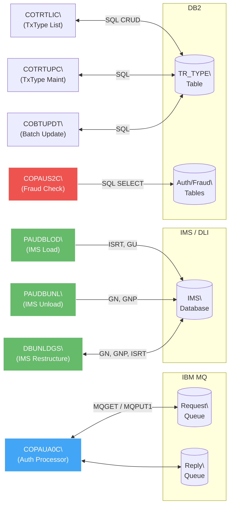

### MQ (Message Queuing)

Only `COPAUA0C` (Authorization Processor) uses MQ APIs.
This program bridges the CICS online application to the authorization
back-end.  It reads requests from a queue, processes them (including
CICS file I/O for account/card/customer lookup), and writes replies.

### IMS/DLI (Information Management System)

Three programs in the `app-authorization-ims-db2-mq` sub-app use IMS DLI:

| Program | DLI Calls | Purpose |
|---------|-----------|---------|
| PAUDBLOD | ISRT, GU | Load auth data into IMS database |
| PAUDBUNL | GN, GNP | Unload auth data from IMS database |
| DBUNLDGS | GN, GNP, ISRT | Unload + restructure IMS segments |

All three call `CBLTDLI` and reference IMS PCBs via copybooks
`PAUTBPCB`, `PADFLPCB`, `PASFLPCB`.

### DB2 (SQL)

| Program | SQL Count | Operations | Table |
|---------|-----------|------------|-------|
| COTRTLIC | 16 | SELECT, INSERT, UPDATE, DELETE | TR_TYPE (transaction types) |
| COTRTUPC | 7 | SELECT, UPDATE, DELETE | TR_TYPE |
| COBTUPDT | 5 | SQL + file READ | TR_TYPE |
| COPAUS2C | 4 | SQL queries | *(auth/fraud tables)* |

### LE (Language Environment) Services

| Program | Call | Purpose |
|---------|------|---------|
| CSUTLDTC | `CEEDAYS` | Convert date to Lilian days |
| All batch programs | `CEE3ABD` | Abnormal termination (abend) |

---

## 9. Impact Analysis Quick-Reference

Use this section when assessing the blast radius of a change.

### Copybook Blast Radius

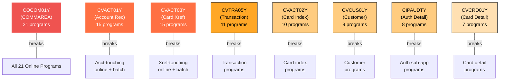

### If You Change a Copybook...

| Copybook | Blast Radius | Programs Affected |
|----------|-------------|-------------------|
| COCOM01Y | **Critical — 21 programs** | All online programs |
| CVACT01Y | **High — 15 programs** | Account-touching online + batch |
| CVACT03Y | **High — 15 programs** | Card xref-touching online + batch |
| CVTRA05Y | **High — 11 programs** | Transaction-touching programs |
| CVACT02Y | Medium — 10 programs | Card index programs |
| CVCUS01Y | Medium — 9 programs | Customer-touching programs |
| CVCRD01Y | Medium — 7 programs | Card detail programs |
| CIPAUDTY | Medium — 8 programs | All auth sub-app programs |

### If You Change a VSAM Dataset Structure...

| Dataset | Programs to Retest | JCL to Update |
|---------|-------------------|---------------|
| ACCTDATA | CBACT01C, CBTRN01C, CBTRN02C, CBACT04C, CBEXPORT, CBSTM03A, COACTUPC, COACTVWC | ACCTFILE, READACCT, POSTTRAN, INTCALC, CBEXPORT, CREASTMT |
| CARDDATA | CBACT02C, CBEXPORT, COCRDSLC, COCRDUPC, COACTVWC, COCRDLIC | CARDFILE, READCARD, CBEXPORT |
| CARDXREF | CBACT03C, CBTRN01C, CBTRN02C, CBTRN03C, CBACT04C, CBEXPORT, CBSTM03A, COCRDLIC | XREFFILE, READXREF, POSTTRAN, INTCALC, TRANREPT, CREASTMT |
| CUSTDATA | CBCUS01C, CBEXPORT, CBSTM03A, COACTUPC, COACTVWC, COCRDSLC, COCRDUPC | CUSTFILE, READCUST, CBEXPORT, CREASTMT |
| TRANSACT | CBTRN01C, CBTRN02C, CBEXPORT, CREASTMT (SORT) | TRANFILE, POSTTRAN, CBEXPORT, CREASTMT, TRANBKP, COMBTRAN |
| USRSEC | COSGN00C, COUSR00C–03C | DUSRSECJ, ESDSRRDS |

### If You Change a Program...

Programs that are XCTL targets of multiple callers (high fan-in):

| Program | Called By |
|---------|----------|
| COMEN01C | COSGN00C, all 21 online programs (via PF3 → CDEMO-TO-PROGRAM) |
| COADM01C | COSGN00C, all admin sub-programs (via PF3) |
| COSGN00C | COMEN01C (PF3), COADM01C (PF3) |
| COCRDSLC | COCRDLIC (view), COACTVWC (detail) |
| COCRDUPC | COCRDLIC (update), COACTVWC (update), COACTUPC (card update) |
| COCRDLIC | COACTUPC (list), COACTVWC (list) |
| COTRTUPC | COTRTLIC (add/update) |
| COPAUS2C | COPAUS1C (LINK for fraud check) |
| CSUTLDTC | CORPT00C, COTRN02C (date validation utility) |

---

*Generated from source analysis of `app/cbl/`, `app/app-*/cbl/`,
`app/cpy/`, `app/cpy-bms/`, `app/app-*/cpy/`, and `app/jcl/`.*
*Cross-references: [APPLICATION_INVENTORY.md](APPLICATION_INVENTORY.md) · [DATA-DICTIONARY.md](DATA-DICTIONARY.md) · [HOTSPOT-ANALYSIS.md](HOTSPOT-ANALYSIS.md)*
