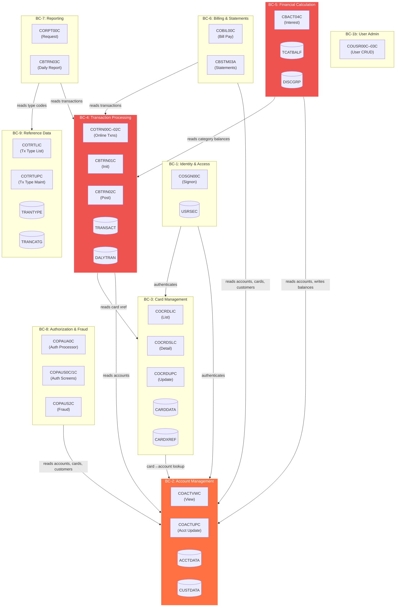

# CardDemo Domain Decomposition

> **Repository:** `EvangelosG/uc-legacy-modernization-cobol-to-java`
> **Companion Documents:** [MODERNIZATION_BLUEPRINT.md](MODERNIZATION_BLUEPRINT.md) | [CUTOVER_PLAN.md](CUTOVER_PLAN.md) | [RISK_REGISTER.md](RISK_REGISTER.md)
> **Source Analysis:** [APPLICATION_INVENTORY.md](APPLICATION_INVENTORY.md) | [DEPENDENCY-MAP.md](DEPENDENCY-MAP.md) | [HOTSPOT-ANALYSIS.md](HOTSPOT-ANALYSIS.md) | [DATA-DICTIONARY.md](DATA-DICTIONARY.md)

---

## Table of Contents

1. [Overview](#1-overview)
2. [Bounded Context Map](#2-bounded-context-map)
3. [Context Definitions & Extraction Seam Analysis](#3-context-definitions--extraction-seam-analysis)
   - [BC-1: Identity & Access](#bc-1-identity--access)
   - [BC-2: Account Management](#bc-2-account-management)
   - [BC-3: Card Management](#bc-3-card-management)
   - [BC-4: Transaction Processing](#bc-4-transaction-processing)
   - [BC-5: Financial Calculation](#bc-5-financial-calculation)
   - [BC-6: Billing & Statements](#bc-6-billing--statements)
   - [BC-7: Reporting](#bc-7-reporting)
   - [BC-8: Authorization & Fraud](#bc-8-authorization--fraud)
   - [BC-9: Reference Data](#bc-9-reference-data)
4. [Context Interaction Map](#4-context-interaction-map)
5. [Shared Kernel Analysis](#5-shared-kernel-analysis)
6. [Data Ownership Matrix](#6-data-ownership-matrix)
7. [Anti-Corruption Layer Design](#7-anti-corruption-layer-design)
8. [Extraction Priority & Sequencing](#8-extraction-priority--sequencing)

---

## 1. Overview

The CardDemo monolith is decomposed into **9 bounded contexts** based on functional cohesion, data ownership, and coupling analysis. Each context represents a candidate microservice or module boundary in the target architecture.

### Decomposition Principles

1. **Data Ownership** — Each bounded context owns exactly one aggregate root and its associated entities. No two contexts write to the same database table.
2. **Functional Cohesion** — Programs that operate on the same business concept and share data mutations are grouped together.
3. **Coupling Minimization** — Contexts communicate via well-defined APIs, not shared memory (COMMAREA) or shared files (VSAM).
4. **Extraction Feasibility** — Boundaries are drawn where natural seams exist in the COBOL code (different VSAM files, different CICS transactions, separate JCL chains).

### Current State: The Monolith

In the COBOL system, boundaries are blurred by:

- **COMMAREA (COCOM01Y)**: A shared 21-program communication area that carries state across all online programs — effectively a global variable.
- **VSAM Cross-File Access**: Programs like COACTUPC read/write 5 VSAM files spanning account, customer, card, xref, and security data.
- **Copybook Coupling**: CVACT01Y (Account Record) is included by 15 programs across what should be 4 separate contexts.
- **Batch Chains**: The POSTTRAN chain (CBTRN01C → CBTRN02C → CBACT04C → CBTRN03C) crosses Transaction Processing, Financial Calculation, and Reporting boundaries.

---

## 2. Bounded Context Map



---

## 3. Context Definitions & Extraction Seam Analysis

### BC-1: Identity & Access

| Attribute | Value |
|-----------|-------|
| **Aggregate Root** | User (SEC-USER-DATA) |
| **Data Owned** | USRSEC.VSAM.KSDS |
| **Programs** | COSGN00C, COUSR00C, COUSR01C, COUSR02C, COUSR03C |
| **Transactions** | CC00 (signon), CU00–CU03 (user admin) |
| **Copybooks** | CSUSR01Y (User Security Record, 80 bytes) |

#### Extraction Seam Analysis

| Seam Type | Assessment | Details |
|-----------|------------|---------|
| **Data Seam** | **Clean** | USRSEC is a self-contained dataset. Only COSGN00C reads it for authentication; COUSR00C–03C perform CRUD. No other bounded context writes to it. |
| **Code Seam** | **Clean** | User admin programs are self-contained CRUD with no cross-domain business logic. COSGN00C reads USRSEC for auth validation, then XCTLs to menu programs. |
| **Integration Seam** | **Clean** | Current auth is simple: read USRSEC, compare password, check user type. No complex flows. |
| **Extraction Difficulty** | **Easy** | Natural first extraction candidate. Replace USRSEC with a `users` table; implement Spring Security for auth. |

**Entanglement Points:**
- CSUSR01Y is included by 14 programs (all online programs carry user context from signon). In the target architecture, this becomes a JWT claim — programs receive user identity via token, not COMMAREA.
- COSGN00C writes user info into COCOM01Y (COMMAREA) — this is the only cross-context write. Replace with JWT payload.

**Anti-Corruption Layer:**
- During transition, the new Auth service issues JWTs. A translation layer maps JWT claims to COMMAREA user fields for legacy programs still running in CICS.

---

### BC-2: Account Management

| Attribute | Value |
|-----------|-------|
| **Aggregate Root** | Account (ACCOUNT-RECORD) |
| **Entities** | Customer (CUSTOMER-RECORD), Account-Customer relationship |
| **Data Owned** | ACCTDATA.VSAM.KSDS, CUSTDATA.VSAM.KSDS |
| **Programs** | COACTVWC (view), COACTUPC (update — account + customer) |
| **Batch Programs** | CBACT01C (account file init), CBCUS01C (customer file init) |
| **Transactions** | CAVW (view), CAUP (update) |
| **Copybooks** | CVACT01Y (Account Record, 300 bytes), CVCUS01Y (Customer Record, 500 bytes) |

#### Extraction Seam Analysis

| Seam Type | Assessment | Details |
|-----------|------------|---------|
| **Data Seam** | **Moderate** | ACCTDATA is read by 8 programs (3 batch, 5 online) across 4 contexts. CUSTDATA is read by 7 programs across 3 contexts. These are the most cross-referenced datasets in the system. |
| **Code Seam** | **Difficult (COACTUPC)** | COACTUPC (4,236 LOC, score 15/15) mixes account update, customer update, SSN validation, phone parsing, date validation, and card xref lookups in a single program. This must be decomposed during extraction. |
| **Integration Seam** | **Moderate** | Other contexts (Card, Transaction, Billing, Auth) read account/customer data but don't write to it. The seam is at the read boundary — expose account data via API. |
| **Extraction Difficulty** | **Hard** | COACTUPC decomposition is the single hardest extraction in the system. All other account operations are straightforward. |

**Entanglement Points:**
- CVACT01Y is included by 15 programs — highest entity-level coupling. In the target, other contexts call the Account API instead of directly reading ACCTDATA.
- COACTUPC reads CARDXREF (BC-3 data) and USRSEC (BC-1 data). The card xref lookup becomes an API call to BC-3; user identity comes from the auth token.
- CBTRN02C (BC-4) and CBACT04C (BC-5) REWRITE account records. These writes must be mediated through the Account API or via domain events.

**Decomposition of COACTUPC:**

```
COACTUPC (4,236 LOC)
  ├─ Account Update Logic       → BC-2: Account Service (PUT /accounts/{id})
  ├─ Customer Update Logic      → BC-2: Customer Service (PUT /customers/{id})
  ├─ SSN Validation             → BC-2: Shared validation utility
  ├─ Phone Parsing              → BC-2: Shared validation utility
  ├─ Date Validation            → Shared library (java.time)
  ├─ Card Xref Lookup           → API call to BC-3 (GET /cards/xref/{acctId})
  └─ CSLKPCDY Lookup (1,318 LOC) → Database reference table or enum
```

**Anti-Corruption Layer:**
- Account API exposes read endpoints consumed by BC-3, BC-4, BC-5, BC-6, BC-7, BC-8.
- Batch programs (CBTRN02C, CBACT04C) that currently REWRITE ACCTDATA directly will publish AccountBalanceUpdated events. The Account service applies these updates.

---

### BC-3: Card Management

| Attribute | Value |
|-----------|-------|
| **Aggregate Root** | Card (CARD-RECORD) |
| **Entities** | Card-Xref (CARD-XREF-RECORD — links card → account → customer) |
| **Data Owned** | CARDDATA.VSAM.KSDS, CARDXREF.VSAM.KSDS |
| **Programs** | COCRDLIC (list), COCRDSLC (detail), COCRDUPC (update) |
| **Batch Programs** | CBACT02C (card file init), CBACT03C (xref file init) |
| **Transactions** | CCLI (list), CCDL (detail), CCUP (update) |
| **Copybooks** | CVACT02Y (Card Record, 150 bytes), CVACT03Y (Card Xref, 50 bytes), CVCRD01Y |

#### Extraction Seam Analysis

| Seam Type | Assessment | Details |
|-----------|------------|---------|
| **Data Seam** | **Moderate** | CARDXREF is read by 15 programs across 5 contexts (Account, Transaction, Financial, Billing, Auth). It's the primary cross-reference linking cards to accounts. CARDDATA is read by 10 programs across 3 contexts. |
| **Code Seam** | **Moderate** | Card programs form a coherent navigation chain (List → Detail → Update). COCRDUPC has an 8-state change machine and 21 GO TOs. |
| **Integration Seam** | **Clean outbound, heavy inbound** | Card programs read ACCTDATA and CUSTDATA (BC-2) for display. Many other contexts read CARDXREF for card-to-account resolution. |
| **Extraction Difficulty** | **Medium** | The programs themselves have clear boundaries. The challenge is CARDXREF — it's the most cross-referenced lookup dataset. |

**Entanglement Points:**
- CVACT03Y (Card Xref) is included by 15 programs. In the target, CARDXREF lookups become API calls: `GET /cards/xref?cardNumber={num}` → returns `{accountId, customerId}`.
- COCRDUPC reads CUSTDATA and ACCTDATA for display context. Replace with API calls to BC-2.
- COCRDLIC uses CICS STARTBR/READNEXT for browse — replace with paginated query API.

**Anti-Corruption Layer:**
- Card Xref API must support high-throughput lookups (every transaction posting calls it). Consider caching with Redis or an in-memory lookup.
- During transition, the legacy CICS programs reading CARDXREF directly continue; new Java services call the Card API.

---

### BC-4: Transaction Processing

| Attribute | Value |
|-----------|-------|
| **Aggregate Root** | Transaction (TRAN-RECORD) |
| **Entities** | DailyTransaction (DALYTRAN-RECORD), TransactionCategoryBalance (TRAN-CAT-BAL-RECORD) |
| **Data Owned** | TRANSACT.VSAM.KSDS, DALYTRAN.PS, DALYREJS, TCATBALF.VSAM.KSDS |
| **Online Programs** | COTRN00C (list), COTRN01C (view), COTRN02C (add) |
| **Batch Programs** | CBTRN01C (init/validate), CBTRN02C (post — **score 14/15**) |
| **JCL** | POSTTRAN (orchestrates daily posting), TRANFILE (VSAM init), TRANBKP (backup), COMBTRAN (merge) |
| **Copybooks** | CVTRA05Y (Transaction, 350 bytes), CVTRA06Y (Daily Txn), CVTRA01Y (Cat Balance) |

#### Extraction Seam Analysis

| Seam Type | Assessment | Details |
|-----------|------------|---------|
| **Data Seam** | **Moderate** | TRANSACT is read by programs in 3 contexts (Billing, Reporting, Data Migration). TCATBALF is shared with BC-5 (Financial Calculation). DALYTRAN is an input-only file — clean boundary. |
| **Code Seam** | **Complex (batch)** | CBTRN02C is the core posting engine (731 LOC, score 14/15). It reads DALYTRAN, validates against XREFFILE (BC-3), writes TRANSACT, updates ACCTDATA (BC-2), and updates TCATBALF. This single program crosses 3 bounded context boundaries. |
| **Integration Seam** | **Difficult** | The batch posting chain is the system's "central nervous system." CBTRN02C writes to datasets owned by BC-2 (ACCTDATA) and BC-5 (TCATBALF) — violating data ownership. |
| **Extraction Difficulty** | **Hard (batch), Easy (online)** | Online transaction screens are clean CRUD. The batch pipeline is the most tightly coupled component in the system. |

**Entanglement Points:**
- CBTRN02C writes to ACCTDATA (BC-2 ownership) — balance updates during posting. Must become an event: `TransactionPosted` → Account Service updates balance.
- CBTRN02C writes to TCATBALF — category balance updates. TCATBALF should be co-owned with BC-4 (it's a transaction-level aggregate), or mediated via BC-5.
- CBTRN02C reads XREFFILE (BC-3) for card-to-account resolution. Replace with Card Xref API call.
- The POSTTRAN JCL chain connects BC-4 → BC-5 → BC-7 sequentially. In the target, this becomes a Spring Batch job flow with step-level context boundaries.

**Proposed Boundary Adjustment:**
- Move TCATBALF ownership to BC-4 (Transaction Processing). It's updated by CBTRN02C during posting and read by CBACT04C (BC-5) during interest calculation. Since posting is the primary writer, it belongs with transactions.
- CBTRN02C's account balance update becomes a domain event consumed by BC-2.

---

### BC-5: Financial Calculation

| Attribute | Value |
|-----------|-------|
| **Aggregate Root** | InterestCalculation (no persistent aggregate — produces SYSTRAN transactions) |
| **Data Owned** | DISCGRP.VSAM.KSDS (disclosure/interest rate groups), SYSTRAN (output) |
| **Programs** | CBACT04C (Interest Calculator — **score 14/15**) |
| **JCL** | INTCALC |
| **Copybooks** | CVTRA02Y (Disclosure Group, 50 bytes) |

#### Extraction Seam Analysis

| Seam Type | Assessment | Details |
|-----------|------------|---------|
| **Data Seam** | **Moderate** | Reads ACCTDATA (BC-2), XREFFILE (BC-3), TCATBALF (BC-4). Writes SYSTRAN and REWRITEs ACCTDATA. DISCGRP is exclusively owned by this context. |
| **Code Seam** | **Clean** | Single-program context (CBACT04C, 652 LOC). Well-structured with no GO TOs. Account break-logic is self-contained. |
| **Integration Seam** | **Moderate** | Reads from 3 other contexts, writes to 1 (ACCTDATA balance update). |
| **Extraction Difficulty** | **Medium** | The program itself is clean. The risk is in preserving exact financial arithmetic during conversion. |

**Entanglement Points:**
- REWRITEs ACCTDATA (BC-2) with updated balances after interest posting. Must become `InterestCalculated` event → Account Service applies balance update.
- Reads TCATBALF (BC-4) for per-category balances. Replace with Transaction Processing API call or shared read-replica view.
- The account break-logic pattern (iterating sorted records, detecting account-ID boundaries) is a batch-specific concern that maps to `GROUP BY` in SQL or Spring Batch's `PeekableItemReader`.

**Anti-Corruption Layer:**
- Interest Calculation service consumes account data via BC-2 API, category balances via BC-4 API, and publishes `InterestCalculated` events.
- During parallel-run validation, both COBOL and Java interest calculators process the same input; results are compared to the penny.

---

### BC-6: Billing & Statements

| Attribute | Value |
|-----------|-------|
| **Aggregate Root** | Statement (output document) |
| **Data Owned** | STATEMNT.PS (text output), STATEMNT.HTML (web output) |
| **Online Programs** | COBIL00C (Bill Payment, 572 LOC) |
| **Batch Programs** | CBSTM03A (Statement Generation), CBSTM03B (subroutine) |
| **JCL** | CREASTMT (orchestrates statement generation with SORT + IDCAMS preprocessing) |
| **Copybooks** | COSTM01, CUSTREC |

#### Extraction Seam Analysis

| Seam Type | Assessment | Details |
|-----------|------------|---------|
| **Data Seam** | **Clean (output)** | Produces output documents (STATEMNT). Reads from BC-2 (ACCTDATA, CUSTDATA), BC-3 (XREFFILE), and BC-4 (TRANSACT) — all read-only. |
| **Code Seam** | **Clean** | COBIL00C is self-contained online. CBSTM03A reads multiple inputs and produces formatted output — classic extract-transform-load. |
| **Integration Seam** | **Clean** | Pure consumer of other contexts' data. No writes back to source datasets. |
| **Extraction Difficulty** | **Easy** | Read-only data consumer with well-defined output formats. |

**Entanglement Points:**
- CREASTMT JCL includes a SORT step and IDCAMS REPRO to prepare TRXFL work file. In the target, replace with SQL `ORDER BY` in the Spring Batch reader.
- CBSTM03A reads 4 VSAM files (BC-2 and BC-3 data). Replace with API calls or shared read views.
- TXT2PDF1 JCL step converts text statements to PDF. Replace with a Java PDF library (iText, Apache PDFBox).

---

### BC-7: Reporting

| Attribute | Value |
|-----------|-------|
| **Aggregate Root** | Report (output document) |
| **Data Owned** | TRANREPT (GDG — report output), DATEPARM (report parameters) |
| **Online Programs** | CORPT00C (Report Request, 649 LOC) |
| **Batch Programs** | CBTRN03C (Daily Transaction Report, 649 LOC) |
| **JCL** | TRANREPT (orchestrates with SORT preprocessing) |
| **Copybooks** | CVTRA07Y (report line layouts) |

#### Extraction Seam Analysis

| Seam Type | Assessment | Details |
|-----------|------------|---------|
| **Data Seam** | **Clean** | Reads TRANSACT (BC-4), CARDXREF (BC-3), TRANTYPE (BC-9), TRANCATG (BC-9). Writes report output only. |
| **Code Seam** | **Clean** | CORPT00C submits a batch job (loose coupling). CBTRN03C is a self-contained report generator with multi-level break logic. |
| **Integration Seam** | **Clean** | Pure read-only consumer. No writes to source data. |
| **Extraction Difficulty** | **Easy** | Classic reporting extraction — replace with a modern reporting service (JasperReports, Spring Batch flat-file writer, or a BI tool). |

**Entanglement Points:**
- CBTRN03C has 72 PERFORMs (highest density) with multi-level break logic (date → card → account). This pattern maps to SQL `GROUP BY` with `ROLLUP` or Spring Batch aggregate processing.
- PIC-edited output fields in CVTRA07Y must produce identical formatting for regulatory compliance. Verify with character-by-character comparison during parallel run.
- CORPT00C calls CSUTLDTC for date validation — use the shared Java date utility.

---

### BC-8: Authorization & Fraud

| Attribute | Value |
|-----------|-------|
| **Aggregate Root** | Authorization (IMS auth summary/detail segments, DB2 AUTHFRDS table) |
| **Data Owned** | IMS databases (auth segments), DB2 AUTHFRDS table, MQ queues |
| **Programs** | COPAUA0C (Auth Processor, MQ), COPAUS0C (Summary), COPAUS1C (Detail), COPAUS2C (Fraud Check, DB2), CBPAUP0C (Batch Purge) |
| **IMS Programs** | PAUDBLOD, PAUDBUNL, DBUNLDGS |
| **Copybooks** | CCPAURQY, CCPAURLY, CCPAUERY, CIPAUDTY, CIPAUSMY, IMSFUNCS, PCB layouts |

#### Extraction Seam Analysis

| Seam Type | Assessment | Details |
|-----------|------------|---------|
| **Data Seam** | **Clean (own data), moderate (reads)** | Owns IMS databases and DB2 auth tables — exclusive ownership. Reads ACCTDATA (BC-2), CARDDATA (BC-3), CUSTDATA (BC-2) for authorization decisions. |
| **Code Seam** | **Isolated (sub-app)** | Already physically separated in `app/app-authorization-ims-db2-mq/` directory. Has its own copybooks, BMS maps, JCL, and CSD definitions. This is the most naturally extractable bounded context. |
| **Integration Seam** | **Complex** | MQ integration (COPAUA0C), IMS DLI calls (3 programs), DB2 SQL (COPAUS2C). Triple external system coupling. |
| **Extraction Difficulty** | **Medium (boundary), High (internals)** | The boundary is clean (sub-app directory). The internal complexity is high due to IMS/MQ/DB2 triple integration. |

**Entanglement Points:**
- COPAUA0C reads ACCTDATA, CARDDATA, CUSTDATA via CICS file I/O for authorization decisions. Replace with API calls to BC-2 and BC-3.
- MQ request/response pattern → replace with Kafka/RabbitMQ event-driven architecture or synchronous REST API.
- IMS database → replace with PostgreSQL tables. IMS hierarchical segments (summary → detail) map to parent-child JPA entities.
- COPAUS1C LINKs to COPAUS2C — the only CICS LINK in the system. Replace with a service method call.

---

### BC-9: Reference Data

| Attribute | Value |
|-----------|-------|
| **Aggregate Root** | TransactionType, TransactionCategory |
| **Data Owned** | TRANTYPE.VSAM.KSDS (+ DB2 TR_TYPE table), TRANCATG.VSAM.KSDS (+ DB2 TR_TYPE_CATEGORY table) |
| **Programs** | COTRTLIC (List, 2,098 LOC), COTRTUPC (Update, 1,702 LOC), COBTUPDT (Batch, 237 LOC) |
| **Transactions** | CTLI (list), CTTU (update) |
| **Copybooks** | CSDB2RPY, CSDB2RWY |

#### Extraction Seam Analysis

| Seam Type | Assessment | Details |
|-----------|------------|---------|
| **Data Seam** | **Clean** | TRANTYPE and TRANCATG are reference lookup tables. Read by CBTRN03C (BC-7) and implicitly by CBTRN02C (BC-4) for validation. No other context writes to these datasets. |
| **Code Seam** | **Isolated (sub-app)** | Programs in `app/app-transaction-type-db2/` with their own copybooks, DDL, and CSD definitions. Dual-technology (CICS + DB2) but self-contained. |
| **Integration Seam** | **Clean** | Admin-only CRUD. Other contexts read the type/category codes for lookups. |
| **Extraction Difficulty** | **Easy (boundary), Medium (code)** | The boundary is natural (sub-app). The code complexity is high (COTRTLIC: 28 GO TOs, 2,098 LOC) but the business logic is simple CRUD — rewrite is straightforward. |

**Entanglement Points:**
- COTRTLIC and COTRTUPC maintain VSAM shadow copies alongside DB2. In the target, eliminate VSAM — DB2 (or PostgreSQL) is the single source of truth.
- CBTRN03C (BC-7) reads TRANTYPE and TRANCATG for description lookups. Replace with Reference Data API: `GET /reference/transaction-types/{code}`.
- CBTRN02C may validate transaction type codes during posting. Replace with a cached reference data lookup.

---

## 4. Context Interaction Map

### Upstream / Downstream Relationships

```
   ┌──────────────┐
   │ BC-1: Identity│  UPSTREAM (provides auth to all)
   │ & Access      │
   └──────┬───────┘
          │ authenticates
          ▼
   ┌──────────────┐
   │ BC-2: Account │  UPSTREAM (most-consumed data)
   │ Management    │
   └──┬───┬───┬───┘
      │   │   │
      │   │   └──────────────────────────────┐
      │   │                                  │
      ▼   ▼                                  ▼
┌─────────┐ ┌──────────────┐          ┌──────────────┐
│ BC-3:   │ │ BC-4: Txn    │          │ BC-8: Auth   │
│ Card    │ │ Processing   │          │ & Fraud      │
│ Mgmt    │ │              │          │              │
└────┬────┘ └──────┬───────┘          └──────────────┘
     │             │
     │             ├─────────────────────┐
     │             │                     │
     │             ▼                     ▼
     │      ┌──────────────┐     ┌──────────────┐
     │      │ BC-5: Financial│    │ BC-7:        │
     │      │ Calculation   │    │ Reporting    │
     │      └──────────────┘     └──────┬───────┘
     │                                  │
     │                                  │ reads type codes
     │                                  ▼
     │                           ┌──────────────┐
     │                           │ BC-9: Ref    │
     │                           │ Data         │
     └───────────────────────┐   └──────────────┘
                             │
                             ▼
                      ┌──────────────┐
                      │ BC-6: Billing│
                      │ & Statements │
                      └──────────────┘
```

### Interaction Types

| Source Context | Target Context | Interaction Type | Current Mechanism | Target Mechanism |
|---------------|---------------|-----------------|-------------------|-----------------|
| BC-1 → All | All | Authentication | COMMAREA user fields | JWT token validation |
| BC-2 → BC-4 | Account data read | VSAM direct read | REST API: `GET /accounts/{id}` |
| BC-2 → BC-6 | Account + Customer data | VSAM direct read | REST API or read replica |
| BC-3 → BC-2 | Card xref → Account | VSAM XREFFILE read | REST API: `GET /cards/xref` |
| BC-3 → BC-4 | Card validation | VSAM CARDDATA read | REST API or cached lookup |
| BC-4 → BC-2 | Balance update | VSAM REWRITE ACCTDATA | Domain event: `TransactionPosted` |
| BC-4 → BC-5 | Category balances | VSAM TCATBALF read | Shared database (same schema) or API |
| BC-5 → BC-2 | Interest posting | VSAM REWRITE ACCTDATA | Domain event: `InterestCalculated` |
| BC-5 → BC-4 | Category balances | VSAM TCATBALF read | Direct DB query (co-located) |
| BC-7 → BC-9 | Type code lookup | VSAM TRANTYPE read | REST API: `GET /reference/types/{code}` |
| BC-8 → BC-2,3 | Account/Card/Customer lookup | CICS READ | REST API calls |

---

## 5. Shared Kernel Analysis

### Current Shared Kernel (Must Be Eliminated)

The COBOL system has an implicit shared kernel — data structures and code shared across all bounded contexts via COPY statements. These must be eliminated during extraction.

| Shared Element | Used By | Decomposition Strategy |
|---------------|---------|----------------------|
| **COCOM01Y (COMMAREA)** | 21 online programs | Eliminate. Replace with: (1) JWT claims for user identity, (2) request parameters for entity IDs, (3) Spring MVC handler state for navigation. Each context defines its own request/response DTOs. |
| **CVACT01Y (Account Record)** | 15 programs, 4 contexts | BC-2 owns the canonical `Account` entity. Other contexts use a read-only `AccountSummary` DTO from the Account API. Never share the full entity. |
| **CVACT03Y (Card Xref Record)** | 15 programs, 5 contexts | BC-3 owns the `CardXref` entity. Expose a lightweight lookup API. Cache results in consumers (xref data changes infrequently). |
| **CVTRA05Y (Transaction Record)** | 11 programs, 3 contexts | BC-4 owns `Transaction`. Expose a query API for BC-6 and BC-7 reads. |
| **CSUSR01Y (User Security Record)** | 14 programs | BC-1 owns `User`. Other contexts receive user identity via JWT — they never access the User table directly. |

### Target: No Shared Kernel

Each bounded context defines its own:
- **Entities** (JPA `@Entity` classes) — owned data
- **DTOs** (API request/response objects) — consumed from other contexts
- **Value Objects** — domain-specific types (e.g., `AccountId`, `CardNumber`, `Money`)

Context boundaries are enforced at the package level:
```
com.carddemo.account.domain.Account        (entity — BC-2 owns)
com.carddemo.account.api.AccountSummaryDto  (DTO — BC-2 publishes)
com.carddemo.transaction.client.AccountClient (Feign client — BC-4 consumes)
```

---

## 6. Data Ownership Matrix

| Dataset (VSAM/DB2/IMS) | Owner Context | Readers | Writers | Migration Target |
|------------------------|---------------|---------|---------|-----------------|
| ACCTDATA | **BC-2** Account | BC-4, BC-5, BC-6, BC-8 | BC-2, BC-4*, BC-5* | `accounts` table (PostgreSQL) |
| CUSTDATA | **BC-2** Account | BC-3, BC-6, BC-8 | BC-2 only | `customers` table |
| CARDDATA | **BC-3** Card | BC-2, BC-6, BC-8 | BC-3 only | `cards` table |
| CARDXREF | **BC-3** Card | BC-2, BC-4, BC-5, BC-6, BC-7 | BC-3 only (init) | `card_xref` table |
| TRANSACT | **BC-4** Transaction | BC-6, BC-7 | BC-4 only | `transactions` table |
| DALYTRAN | **BC-4** Transaction | — | External (input) | Staging table or file upload |
| TCATBALF | **BC-4** Transaction | BC-5 | BC-4, BC-5* | `transaction_category_balances` table |
| DISCGRP | **BC-5** Financial | — | Admin (init only) | `disclosure_groups` table |
| USRSEC | **BC-1** Identity | — | BC-1 only | `users` table |
| TRANTYPE | **BC-9** Reference | BC-7 | BC-9 only | `transaction_types` table |
| TRANCATG | **BC-9** Reference | BC-7 | BC-9 only | `transaction_categories` table |
| IMS Auth DBs | **BC-8** Auth | — | BC-8 only | `authorizations`, `auth_details` tables |
| DB2 AUTHFRDS | **BC-8** Auth | — | BC-8 only | `authorization_fraud_records` table |
| DB2 TR_TYPE | **BC-9** Reference | — | BC-9 only | `transaction_types` table (same as TRANTYPE) |

*\* Cross-context writes that must be refactored into domain events (see Section 7).*

---

## 7. Anti-Corruption Layer Design

During the migration, legacy COBOL programs and new Java services coexist. Anti-corruption layers (ACLs) prevent legacy coupling from leaking into the new architecture.

### ACL-1: COMMAREA Translation Layer

```
┌─────────────────┐     ┌──────────────────┐     ┌─────────────────┐
│  New Java UI     │     │  ACL: COMMAREA   │     │  Legacy CICS    │
│  (React/Angular) │────▶│  Translator      │────▶│  Programs       │
│                  │     │                  │     │                  │
│  JWT token       │     │  JWT → COMMAREA  │     │  Reads COCOM01Y │
│  REST requests   │     │  fields mapping  │     │  XCTL dispatch  │
└─────────────────┘     └──────────────────┘     └─────────────────┘
```

**When:** Active during Phases 1–3 while some screens are still CICS-based.
**Purpose:** The new auth service issues JWTs. The translator maps JWT claims into the COMMAREA user fields that legacy programs expect.

### ACL-2: VSAM-to-API Gateway

```
┌─────────────────┐     ┌──────────────────┐     ┌─────────────────┐
│  New Java        │     │  ACL: Data       │     │  Legacy VSAM    │
│  Services        │────▶│  Access Facade   │────▶│  Files (CICS)   │
│                  │     │                  │     │                  │
│  JPA/JDBC        │     │  Routes to:      │     │  EXEC CICS      │
│  queries         │     │  - PostgreSQL    │     │  READ/WRITE     │
│                  │     │    (migrated)    │     │                  │
│                  │     │  - VSAM proxy    │     │                  │
│                  │     │    (not yet)     │     │                  │
└─────────────────┘     └──────────────────┘     └─────────────────┘
```

**When:** Active during data migration. Removed once all data is in PostgreSQL.
**Purpose:** New services query a unified data access layer. The facade routes to PostgreSQL for migrated entities and to a VSAM proxy (via CICS Transaction Gateway or similar) for entities not yet migrated.

### ACL-3: Event Bridge for Cross-Context Writes

```
┌─────────────────┐     ┌──────────────────┐     ┌─────────────────┐
│  BC-4: Txn       │     │  ACL: Event      │     │  BC-2: Account  │
│  Processing      │────▶│  Bridge          │────▶│  Management     │
│                  │     │                  │     │                  │
│  Posts txns      │     │  TransactionPosted│    │  Updates balance │
│  Publishes event │     │  → Kafka topic   │     │  Applies event  │
│                  │     │  → VSAM REWRITE  │     │                  │
│                  │     │    (legacy path)  │     │                  │
└─────────────────┘     └──────────────────┘     └─────────────────┘
```

**When:** Active during the transition from direct VSAM writes to event-driven updates.
**Purpose:** CBTRN02C currently REWRITEs ACCTDATA directly. During transition, the Event Bridge publishes a `TransactionPosted` event and also applies the VSAM REWRITE (dual-write). Once BC-2 is fully migrated, the VSAM path is removed.

---

## 8. Extraction Priority & Sequencing

Based on seam analysis, coupling, and business risk:

| Priority | Context | Difficulty | Rationale |
|----------|---------|------------|-----------|
| **1** | **BC-1: Identity & Access** | Easy | Clean data seam, self-contained, enables strangler routing for all other contexts. |
| **2** | **BC-9: Reference Data** | Easy (boundary) / Medium (code) | Self-contained sub-app, no inbound dependencies from other contexts. Rewrite as simple CRUD. |
| **3** | **BC-7: Reporting** | Easy | Pure read-only consumer. No data ownership conflicts. |
| **4** | **BC-6: Billing & Statements** | Easy | Pure read-only consumer (output-focused). |
| **5** | **BC-3: Card Management** | Medium | CARDXREF is heavily cross-referenced, but card programs themselves are cohesive. Extract card data API early to enable other contexts. |
| **6** | **BC-2: Account Management** | Hard (COACTUPC) | Most-consumed data source. COACTUPC decomposition is the hardest task. Extract Account View first, then tackle Update. |
| **7** | **BC-4: Transaction Processing** | Hard (batch) | Core batch pipeline crosses context boundaries. Requires parallel-run validation. |
| **8** | **BC-5: Financial Calculation** | Medium (code) / High (risk) | Single program, clean structure, but financial accuracy is critical. Must follow BC-4. |
| **9** | **BC-8: Authorization & Fraud** | High | Triple external system integration (IMS/DB2/MQ). Replatform first, then rewrite. |

---

*Cross-references: [MODERNIZATION_BLUEPRINT.md](MODERNIZATION_BLUEPRINT.md) | [CUTOVER_PLAN.md](CUTOVER_PLAN.md) | [RISK_REGISTER.md](RISK_REGISTER.md)*
